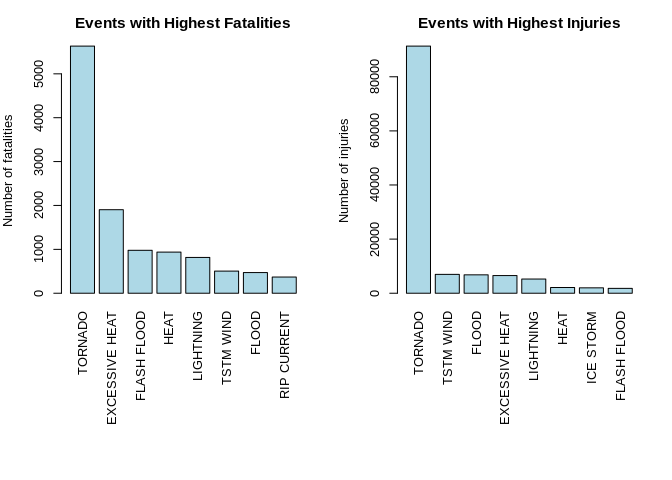
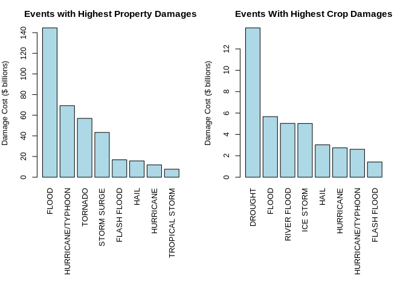

## Studies on the effect of weather events on personal as well as property damages in US based on NOAA database.
#### 1.Synopsis

#### Storms and other severe weather events can cause both public health and economic problems for communities and municipalities. Many severe events can result in fatalities, injuries, and property damage, and preventing such outcomes to the extent possible is a key concern.

#### This project involves exploring the U.S. National Oceanic and Atmospheric Administration’s (NOAA) storm database. This database tracks characteristics of major storms and weather events in the United States, including when and where they occur, as well as estimates of any fatalities, injuries, and property damage.

#### In this report,effect of weather events on personal as well as property damages was studied. Barplots were plotted seperately for the top 8 weather events that causes highest fatalities and highest injuries. Results indicate that most Fatalities and injuries were caused by Tornados.Also, barplots were plotted for the top 8 weather events that causes the highest property damage and crop damage.


## 2.Data Processing

### 2.1 Data

#### The data for this assignment come in the form of a comma-separated-value file compressed via the bzip2 algorithm to reduce its size. You can download the file from the course web site, There is also some documentation of the database available. Here you will find how some of the variables are constructed/defined.

#### The events in the database start in the year 1950 and end in November 2011. In the earlier years of the database there are generally fewer events recorded, most likely due to a lack of good records. More recent years should be considered more complete.


### 2.2 Assignment

#### The basic goal of this assignment is to explore the NOAA Storm Database and answer the following basic questions about severe weather events.

#### 1.Across the United States, which types of events (as indicated in the EVTYPE variable) are most harmful with respect to population health?

#### 2.Across the United States, which types of events have the greatest economic consequences?


## 2.3 Process
### 2.3.1 Loading the data


```r
data <- read.csv("repdata_data_StormData.csv.bz2")
head(data)
```

```
##   STATE__           BGN_DATE BGN_TIME TIME_ZONE COUNTY COUNTYNAME STATE
## 1       1  4/18/1950 0:00:00     0130       CST     97     MOBILE    AL
## 2       1  4/18/1950 0:00:00     0145       CST      3    BALDWIN    AL
## 3       1  2/20/1951 0:00:00     1600       CST     57    FAYETTE    AL
## 4       1   6/8/1951 0:00:00     0900       CST     89    MADISON    AL
## 5       1 11/15/1951 0:00:00     1500       CST     43    CULLMAN    AL
## 6       1 11/15/1951 0:00:00     2000       CST     77 LAUDERDALE    AL
##    EVTYPE BGN_RANGE BGN_AZI BGN_LOCATI END_DATE END_TIME COUNTY_END
## 1 TORNADO         0                                               0
## 2 TORNADO         0                                               0
## 3 TORNADO         0                                               0
## 4 TORNADO         0                                               0
## 5 TORNADO         0                                               0
## 6 TORNADO         0                                               0
##   COUNTYENDN END_RANGE END_AZI END_LOCATI LENGTH WIDTH F MAG FATALITIES
## 1         NA         0                      14.0   100 3   0          0
## 2         NA         0                       2.0   150 2   0          0
## 3         NA         0                       0.1   123 2   0          0
## 4         NA         0                       0.0   100 2   0          0
## 5         NA         0                       0.0   150 2   0          0
## 6         NA         0                       1.5   177 2   0          0
##   INJURIES PROPDMG PROPDMGEXP CROPDMG CROPDMGEXP WFO STATEOFFIC ZONENAMES
## 1       15    25.0          K       0                                    
## 2        0     2.5          K       0                                    
## 3        2    25.0          K       0                                    
## 4        2     2.5          K       0                                    
## 5        2     2.5          K       0                                    
## 6        6     2.5          K       0                                    
##   LATITUDE LONGITUDE LATITUDE_E LONGITUDE_ REMARKS REFNUM
## 1     3040      8812       3051       8806              1
## 2     3042      8755          0          0              2
## 3     3340      8742          0          0              3
## 4     3458      8626          0          0              4
## 5     3412      8642          0          0              5
## 6     3450      8748          0          0              6
```

## 2.3.2 Extracting the required data

#### This dataset consists of lot of information most of which is not required for our present study. So, here is the code to extract the required data for health and economic impact analysis against weather.


```r
data <- data[c("EVTYPE", "FATALITIES", "INJURIES", "PROPDMG", "PROPDMGEXP", "CROPDMG", 
           "CROPDMGEXP")]
```

## 2.3.3 Finding property damage

#### Property damage exponents for each level was listed out and assigned those values for the property exponent data. Invalid data was excluded by assigning the value as ‘0’. Then property damage value was calculated by multiplying the property damage and property exponent value.The code for this process was listed below


```r
# Finding the property damage exponent and levels
unique(data$PROPDMGEXP)
```

```
##  [1] K M   B m + 0 5 6 ? 4 2 3 h 7 H - 1 8
## Levels:  - ? + 0 1 2 3 4 5 6 7 8 B h H K m M
```


##

```r
# Assigning values for the property exponent data 
data$PROPEXP[data$PROPDMGEXP == "K"] <- 1000
data$PROPEXP[data$PROPDMGEXP == "M"] <- 1e+06
data$PROPEXP[data$PROPDMGEXP == ""] <- 1
data$PROPEXP[data$PROPDMGEXP == "B"] <- 1e+09
data$PROPEXP[data$PROPDMGEXP == "m"] <- 1e+06
data$PROPEXP[data$PROPDMGEXP == "0"] <- 1
data$PROPEXP[data$PROPDMGEXP == "5"] <- 1e+05
data$PROPEXP[data$PROPDMGEXP == "6"] <- 1e+06
data$PROPEXP[data$PROPDMGEXP == "4"] <- 10000
data$PROPEXP[data$PROPDMGEXP == "2"] <- 100
data$PROPEXP[data$PROPDMGEXP == "3"] <- 1000
data$PROPEXP[data$PROPDMGEXP == "h"] <- 100
data$PROPEXP[data$PROPDMGEXP == "7"] <- 1e+07
data$PROPEXP[data$PROPDMGEXP == "H"] <- 100
data$PROPEXP[data$PROPDMGEXP == "1"] <- 10
data$PROPEXP[data$PROPDMGEXP == "8"] <- 1e+08
# Assigning '0' to invalid exponent data
data$PROPEXP[data$PROPDMGEXP == "+"] <- 0
data$PROPEXP[data$PROPDMGEXP == "-"] <- 0
data$PROPEXP[data$PROPDMGEXP == "?"] <- 0
# Calculating the property damage value
data$PROPDMGVAL <- data$PROPDMG * data$PROPEXP
```

## 2.3.4 Finding crop damage

#### Crop damage exponents for each level was listed out and assigned those values for the crop exponent data. Invalid data was excluded by assigning the value as ‘0’. Then crop damage value was calculated by multiplying the crop damage and crop exponent value.The code for this process was listed below


```r
# Exploring the crop exponent data
unique(data$CROPDMGEXP)
```

```
## [1]   M K m B ? 0 k 2
## Levels:  ? 0 2 B k K m M
```

##

```r
# Assigning values for the crop exponent data 
data$CROPEXP[data$CROPDMGEXP == "M"] <- 1e+06
data$CROPEXP[data$CROPDMGEXP == "K"] <- 1000
data$CROPEXP[data$CROPDMGEXP == "m"] <- 1e+06
data$CROPEXP[data$CROPDMGEXP == "B"] <- 1e+09
data$CROPEXP[data$CROPDMGEXP == "0"] <- 1
data$CROPEXP[data$CROPDMGEXP == "k"] <- 1000
data$CROPEXP[data$CROPDMGEXP == "2"] <- 100
data$CROPEXP[data$CROPDMGEXP == ""] <- 1
# Assigning '0' to invalid exponent data
data$CROPEXP[data$CROPDMGEXP == "?"] <- 0
# calculating the crop damage value
data$CROPDMGVAL <- data$CROPDMG * data$CROPEXP
```

## 2.3.5 Finding totals of each incident by event type.

#### It was observed that " most harmful to population health" events are fatalities and injuries.So,only those events with fatalities and injuries were selecetd.

#### It was observed that " most harmful to econamic problem“” events are Property and crop damages.So,only those events with property and crop damage were selecetd.

#### Then for each incident (Fatalities,Injuries, Property damage and Crop damage), the total values were estimated. Code for which is as follows.


```r
# Totalling the data by event
fatal <- aggregate(FATALITIES ~ EVTYPE, data, FUN = sum)
injury <- aggregate(INJURIES ~ EVTYPE, data, FUN = sum)
propdmg <- aggregate(PROPDMGVAL ~ EVTYPE, data, FUN = sum)
cropdmg <- aggregate(CROPDMGVAL ~ EVTYPE, data, FUN = sum)
```

## 2.3.6 Plotting events with highest fatalities and highest injuries.

#### Highest fatalities and highest injuries for Top 8 events were calculated. For better understanding and comparision these values were plotted as follows.


```r
# Listing  events with highest fatalities
fatal8 <- fatal[order(-fatal$FATALITIES), ][1:8, ]
# Listing events with highest injuries
injury8 <- injury[order(-injury$INJURIES), ][1:8, ]
par(mfrow = c(1, 2), mar = c(12, 4, 3, 2), mgp = c(3, 1, 0), cex = 0.8)
barplot(fatal8$FATALITIES, las = 3, names.arg = fatal8$EVTYPE, main = "Events with Highest Fatalities", 
        ylab = "Number of fatalities", col = "light blue")
barplot(injury8$INJURIES, las = 3, names.arg = injury8$EVTYPE, main = "Events with Highest Injuries", 
        ylab = "Number of injuries", col = "light blue")
```

<!-- -->

## 2.3.7 Plotting events with highest Property damage and highest crop damage.

#### Highest Property damage and highest crop damage for Top 8 events were calculated. For better understanding and comparision these values were plotted as follows.

```r
# Finding events with highest property damage
propdmg8 <- propdmg[order(-propdmg$PROPDMGVAL), ][1:8, ]
# Finding events with highest crop damage
cropdmg8 <- cropdmg[order(-cropdmg$CROPDMGVAL), ][1:8, ]
par(mfrow = c(1, 2), mar = c(12, 4, 3, 2), mgp = c(3, 1, 0), cex = 0.8)
barplot(propdmg8$PROPDMGVAL/(10^9), las = 3, names.arg = propdmg8$EVTYPE, 
        main = "Events with Highest Property Damages", ylab = "Damage Cost ($ billions)", 
        col = "lightblue")
barplot(cropdmg8$CROPDMGVAL/(10^9), las = 3, names.arg = cropdmg8$EVTYPE, 
        main = "Events With Highest Crop Damages", ylab = "Damage Cost ($ billions)", 
        col = "lightblue")
```

<!-- -->


## 3.Results and Conclusions

#### Tornados caused the maximum number of fatalities and injuries. It was followed by Excessive Heat for fatalities and Thunderstorm wind for injuries.

#### Floods caused the maximum property damage where as Drought caused the maximum crop damage. Second major events that caused the maximum damage was Hurricanes/Typhoos for property damage and Floods for crop damage.
