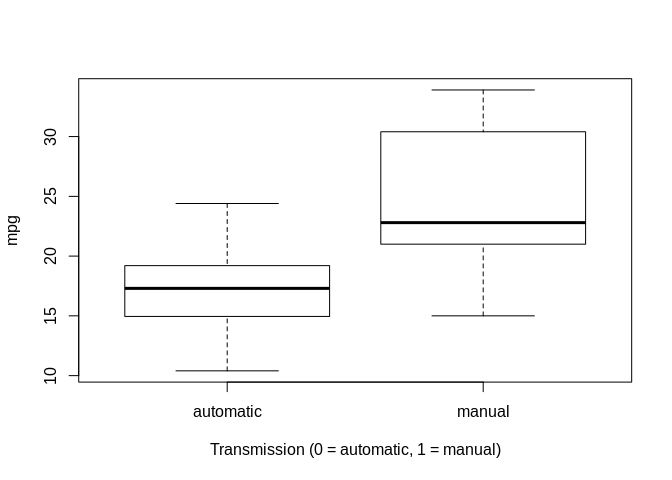
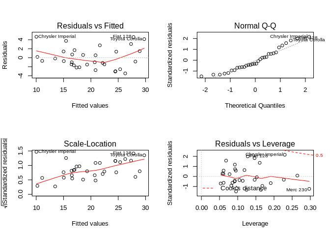

### Executive Summary

#### In this report, we look at a data set of a collection of car, and are interested in exploring the relationship between a set of variables and miles per gallon (MPG) (outcome). Particularly, we are interested in the following two questions:

    * “Is an automatic or manual transmission better for MPG”
    * “Quantify the MPG difference between automatic and manual transmissions”

#### In order to answer these two questions, we follow the steps below:

    * Load and process the data such that it makes more sense
    * Conduct a basic exploratory data analyses to show the relationship between mpg and am
    * Fit multiple models to the data and select the best model
    * Diagnose the model and quantify the uncertainty
    * Using the model we choose, draw conclusion and answer the questions

## Load and Process the Data

#### Load the mtcars dataset and have a overview of it.

```r
library(ggplot2)
```

```
## Registered S3 methods overwritten by 'ggplot2':
##   method         from 
##   [.quosures     rlang
##   c.quosures     rlang
##   print.quosures rlang
```

```r
data(mtcars)
head(mtcars)
```

```
##                    mpg cyl disp  hp drat    wt  qsec vs am gear carb
## Mazda RX4         21.0   6  160 110 3.90 2.620 16.46  0  1    4    4
## Mazda RX4 Wag     21.0   6  160 110 3.90 2.875 17.02  0  1    4    4
## Datsun 710        22.8   4  108  93 3.85 2.320 18.61  1  1    4    1
## Hornet 4 Drive    21.4   6  258 110 3.08 3.215 19.44  1  0    3    1
## Hornet Sportabout 18.7   8  360 175 3.15 3.440 17.02  0  0    3    2
## Valiant           18.1   6  225 105 2.76 3.460 20.22  1  0    3    1
```
#### Change some variables to factor since they represent categories not continuous values.

```r
mtcars$cyl <- as.factor(mtcars$cyl)
mtcars$vs <- as.factor(mtcars$vs)
mtcars$am <- factor(mtcars$am)
levels(mtcars$am) <- c("automatic", "manual")
mtcars$gear <- factor(mtcars$gear)
mtcars$carb <- factor(mtcars$carb)
```
## Exploratory Analyses
#### We are interested in the relationship between mpg (miles per gallon) and am (transmission), so let’s take a look.


```r
boxplot(mpg ~ am, data = mtcars, xlab = "Transmission (0 = automatic, 1 = manual)")
```

<!-- -->


#### Box plot clearly shows that there’s a good separation between two groups, and cars with manual transmission have higher mpg than cars with automatice transmission.

## Statistical Inference

#### We can also conduct a T-test to confirm our observation. Define the null hypothesis as manual and automatic transmissions result in the same mpg.


```r
t.test(mpg ~ am, data = mtcars)
```

```
## 
## 	Welch Two Sample t-test
## 
## data:  mpg by am
## t = -3.7671, df = 18.332, p-value = 0.001374
## alternative hypothesis: true difference in means is not equal to 0
## 95 percent confidence interval:
##  -11.280194  -3.209684
## sample estimates:
## mean in group automatic    mean in group manual 
##                17.14737                24.39231
```
#### P-value is 0.00137, and confidence interval does not include zero, so we reject the null hypothesis and accept the difference in mpg between manual and automatic transmission, which we observed earlier.
## Regression Models
### Simple Model

#### First we use the simplest model with mpg as outcome and am as predictor.


```r
simpleMod <- lm(mpg ~ am, mtcars)
summary(simpleMod)
```

```
## 
## Call:
## lm(formula = mpg ~ am, data = mtcars)
## 
## Residuals:
##     Min      1Q  Median      3Q     Max 
## -9.3923 -3.0923 -0.2974  3.2439  9.5077 
## 
## Coefficients:
##             Estimate Std. Error t value Pr(>|t|)    
## (Intercept)   17.147      1.125  15.247 1.13e-15 ***
## ammanual       7.245      1.764   4.106 0.000285 ***
## ---
## Signif. codes:  0 '***' 0.001 '**' 0.01 '*' 0.05 '.' 0.1 ' ' 1
## 
## Residual standard error: 4.902 on 30 degrees of freedom
## Multiple R-squared:  0.3598,	Adjusted R-squared:  0.3385 
## F-statistic: 16.86 on 1 and 30 DF,  p-value: 0.000285
```


#### This shows that cars with automatic transmission have 17.147 average mpg, whereas cars with manual transmission have averagely 7.245 mpg higher. The p-values are very low, but the R-squared value is 0.3385, which means that the model can only explain 33.85% of the mpg variance. Therefore, we need to take more variables into consideration.

## Full Model

#### We then fit all variables into the model.

```r
fullMod <- lm(mpg ~ ., mtcars)
summary(fullMod)
```

```
## 
## Call:
## lm(formula = mpg ~ ., data = mtcars)
## 
## Residuals:
##     Min      1Q  Median      3Q     Max 
## -3.5087 -1.3584 -0.0948  0.7745  4.6251 
## 
## Coefficients:
##             Estimate Std. Error t value Pr(>|t|)  
## (Intercept) 23.87913   20.06582   1.190   0.2525  
## cyl6        -2.64870    3.04089  -0.871   0.3975  
## cyl8        -0.33616    7.15954  -0.047   0.9632  
## disp         0.03555    0.03190   1.114   0.2827  
## hp          -0.07051    0.03943  -1.788   0.0939 .
## drat         1.18283    2.48348   0.476   0.6407  
## wt          -4.52978    2.53875  -1.784   0.0946 .
## qsec         0.36784    0.93540   0.393   0.6997  
## vs1          1.93085    2.87126   0.672   0.5115  
## ammanual     1.21212    3.21355   0.377   0.7113  
## gear4        1.11435    3.79952   0.293   0.7733  
## gear5        2.52840    3.73636   0.677   0.5089  
## carb2       -0.97935    2.31797  -0.423   0.6787  
## carb3        2.99964    4.29355   0.699   0.4955  
## carb4        1.09142    4.44962   0.245   0.8096  
## carb6        4.47757    6.38406   0.701   0.4938  
## carb8        7.25041    8.36057   0.867   0.3995  
## ---
## Signif. codes:  0 '***' 0.001 '**' 0.01 '*' 0.05 '.' 0.1 ' ' 1
## 
## Residual standard error: 2.833 on 15 degrees of freedom
## Multiple R-squared:  0.8931,	Adjusted R-squared:  0.779 
## F-statistic:  7.83 on 16 and 15 DF,  p-value: 0.000124
```
#### This time the R-squared value 0.8931 is decent. However, the p-values are all greater than 5% and hence show no significance. We then need to select the most significant variables. This can be done by backward selection using step function.

## Step Model


#### The resulting model is mpg ~ wt + qsec + am, with all p-values smaller than 5% and the adjusted R-squared value 0.8336 which accouts for 83.36% of the variance in mpg.

#### The am coefficient indicates that holding wt and qsec constant, cars with manual transmission have 2.9358 more mpg than cars with automatic transmission on average.

## Model diagnosis

#### The 95% two-sided confidence interval of the coefficients are as follows:

```r
confint(stepMod)
```

```
##                   2.5 %    97.5 %
## (Intercept) -4.63829946 23.873860
## wt          -5.37333423 -2.459673
## qsec         0.63457320  1.817199
## ammanual     0.04573031  5.825944
```

#### Let’s plot the diagnosis of the model.

```r
par(mfrow = c(2, 2))
plot(stepMod)
```

<!-- -->

## Conclusion

#### From the above analysis, we can conclude that a manual transmission is better in terms of MPG than an automatic transmission. Holding weight (lb/1000) and qsec (1/4 mile time) constant, a manual tranmission has averagely 2.9358 more MPG (miles per gallon) than an automatic transmission.
