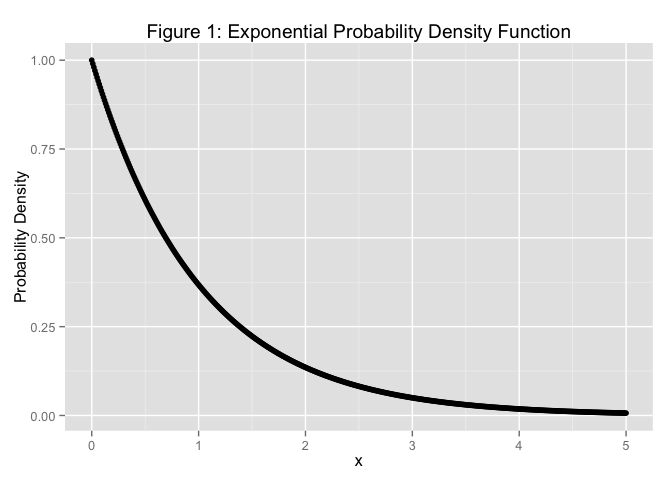
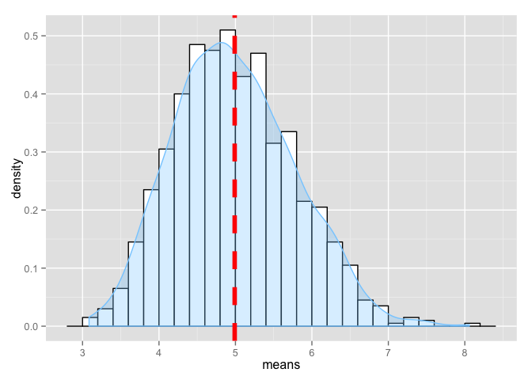

<!-- https://class.coursera.org/statinference-012/human_grading/view/courses/973520/assessments/4/submissions -->
<!-- https://rstudio-pubs-static.s3.amazonaws.com/26693_e1151035722942b2813c0063c6b220ae.html -->
<!-- https://rpubs.com/abhiuee/53828 -->
# The Exponential Distribution -- An Investigation Using R
#### Author: Danilo Mutti


This report aims at investigating the exponential distribution  in R and comparing it with the Central Limit Theorem. The investigation consists of one thousand simulations, each one them comprised of the averages of 40 exponentials. This investigation utilizes R because it is the most comprehensive statistical analysis package available. It incorporates all of the standard statistical tests, models, and analyses, as well as providing a comprehensive language for managing and manipulating data.

### The Central Limit Theorem

The central limit theorem (CLT) states that, given certain conditions, the arithmetic mean of a sufficiently large number of iterates of independent random variables, each with a well-defined expected value and well-defined variance, will be approximately normally distributed, regardless of the underlying distribution. That is, suppose that a sample is obtained containing a large number of observations, each observation being randomly generated in a way that does not depend on the values of the other observations, and that the arithmetic average of the observed values is computed. If this procedure is performed many times, the central limit theorem says that the computed values of the average will be distributed according to the normal distribution (commonly known as a "bell curve") [(Wikipedia)](http://en.wikipedia.org/wiki/Central_limit_theorem], the central limit theorem (CLT)).

### The Exponential Distribution

The exponential distribution describes the arrival time of a randomly recurring independent event sequence. If `mu` is the mean waiting time for the next event recurrence, its probability density function is `f(x) = (1/mu * e ^ (-x/mu)) when x >= 0; 0 when x < 0`. If we call `lambda (rate) = 1 / mu`, then the **exponential probability density function (dexp)** becomes `f(x) = lambda * e ^ (-lambda * x)`. The following is the plot of the exponential probability density function.


```r
x <- seq(0.0, 5.0, 0.01)
y <- dexp(x)
qplot(x, y, type="l", xlab = "x", ylab = "Probability Density", main = "Figure 1: Exponential Probability Density Function")
```

 

The exponential distribution can be simulated in R with `rexp(n, lambda)` where `lambda` is the rate parameter. The mean of exponential distribution is `1/lambda` and the standard deviation is also `1/lambda`. The investigation consists of one thousand simulations, each one them comprised of the averages of 40 exponentials. The value of lambda used in the `rexp` function is fixed in 0.2 for all of the simulations.

This experiment parameters are the following.

```r
sims <- 1000
lambda <- 0.2
n <- 40
```

### Objectives

The specific objectives of this report are the following:

1. Show the sample mean and compare it to the theoretical mean of the distribution.
1. Show how variable the sample is (via variance) and compare it to the theoretical variance of the distribution.
1. Show that the distribution is approximately normal.

## Simulation

In order to keep this report reproducible, we must set a random seed -- a number on which the random number stream depends on -- so the reader can obtain exactly the same numbers in his/her R environment when following the steps presented in this report. In our case, the seed is set to the integer number `1`.


```r
set.seed(1)
```

We start by generating 1000 random samples of size 40, with rate (lambda) equals 0.2. Then, we store the calculated mean of these several samples into the `means` vector.


```r
exp_sim <- matrix(rexp(sims * n, lambda), sims, n)
means <- rowMeans(exp_sim)
```

### 1. Sample Mean versus Theoretical Mean

The sample mean, is obtained in what follows.


```r
print(sample_mean <- mean(means))
```

```
## [1] 4.990025
```

```r
print(theoretical_mean <- 1/lambda)
```

```
## [1] 5
```

The mean of 1000 samples when sample size is 40 is **4.9900252**. The theoretical mean from the distribution is 1/lambda; when lambda is 0.2 the theoretical mean is **5**. When comparing the estimated value and the theoretical one, there is a small difference between then, -0.0099748, to be exact.

### 2. Sample variance versus Theoretical Variance


```r
print(sample_variance <- var(means))
```

```
## [1] 0.6177072
```

```r
print(theoretical_variance <- ((1 / lambda)^2)/40)
```

```
## [1] 0.625
```

The sample variance is **0.6177072** and the theoretical variance is **0.625**. When comparing the estimated value and the theoretical one, there is a small difference between then, -0.0072928, to be exact.

### 3. Distribution

The following plot contains the histogram (light blue) of the means of 1000 random samples of size 40. It also contains the density curve (blue) to demonstrate how it approximates the normal distribution. Additionally, the dashed red line representes the mean of the sample.


```r
ggplot(data.frame(means), aes(x = means)) + geom_histogram(aes(y=..density..), colour = "black", fill = "white", binwidth = lambda) + geom_density(colour = "skyblue1", fill="skyblue1", alpha = .3) + geom_vline(aes(xintercept = sample_mean), linetype = "dashed", size = 2, colour = "red") + scale_x_continuous(breaks = c(1:10))
```

 

## Appendix

This section contains the environment in which this report was produced.


```r
sessionInfo()
```

```
## R version 3.1.2 (2014-10-31)
## Platform: x86_64-apple-darwin13.4.0 (64-bit)
## 
## locale:
## [1] C
## 
## attached base packages:
## [1] stats     graphics  grDevices utils     datasets  methods   base     
## 
## other attached packages:
## [1] ggplot2_1.0.0
## 
## loaded via a namespace (and not attached):
##  [1] MASS_7.3-35      Rcpp_0.11.3      colorspace_1.2-4 digest_0.6.6    
##  [5] evaluate_0.5.5   formatR_1.0      grid_3.1.2       gtable_0.1.2    
##  [9] htmltools_0.2.6  knitr_1.9        labeling_0.3     munsell_0.4.2   
## [13] plyr_1.8.1       proto_0.3-10     reshape2_1.4.1   rmarkdown_0.3.10
## [17] scales_0.2.4     stringr_0.6.2    tools_3.1.2      yaml_2.1.13
```
