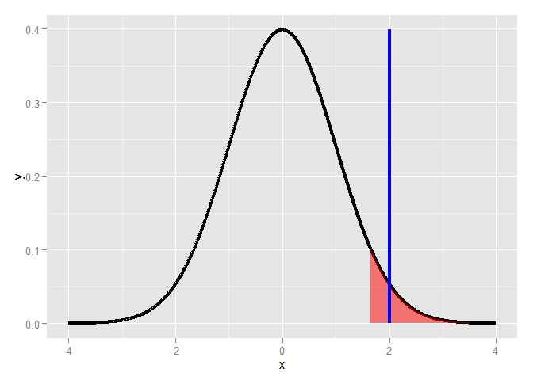
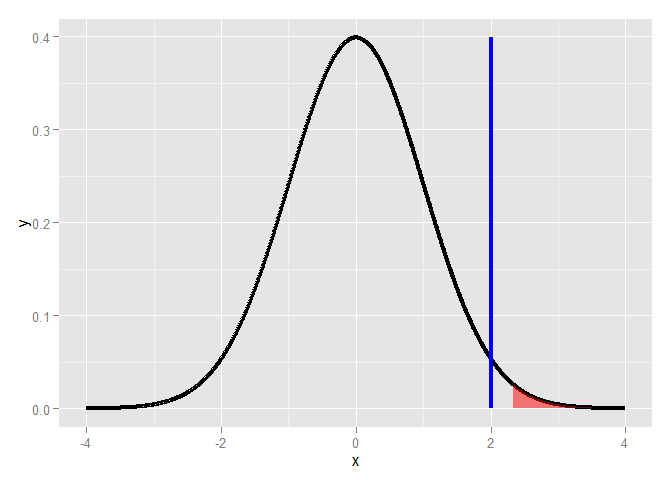

# P Values

[Source](https://github.com/swirldev/swirl_courses/tree/master/Statistical_Inference/P_Values)


In this lesson, as the name suggests, we'll discuss p-values which have nothing to do with urological testing. Instead they are the most common measure of statistical significance.

However, because they're popular they're used a lot, and often they're misused or misinterpreted. In this lecture we'll focus on how to generate them and interpret them correctly.

The question motivating p-values is this. Given that we have some null hypothesis concerning our data (for example, its mean), how unusual or extreme is the sample value we get from our data? Is our test statistic consistent with our hypothesis? So there are, implicitly, three steps we have to take to answer these types of questions.

What do you think the first step is?

```
Create a null hypothesis
```

So we have to begin with a null hypothesis which is a reasoned guess at some distribution of a data summary (a statistic). Recall from the last lesson that the null hypothesis H_0 is a baseline against which we'll measure an alternative hypothesis using the actual observed data.

So you propose a null hypothesis. What's the next step?

```
Calculate a test statistic from the given data
```

Now you have a proposed statistic (from your reasoned hypothesis) and a test statistic computed from your gathered data. What's the final step?

```
Compare the test statistic to the hypothetical distribution
```

Your comparison tells you how "extreme" the test value is toward the alternative hypothesis. The p-value is the probability under the null hypothesis of obtaining evidence as or more extreme than your test statistic (obtained from your observed data) in the direction of the alternative hypothesis.

So if the p-value (probability of seeing your test statistic) is small, then one of two things happens. EITHER H_0 is true and you have observed a rare event (in this unusual test statistic) OR H_0 is false. Let's go through an example.

Suppose that you get a t statistic of 2.5 with 15 df testing H_0, (that mu = mu_0) versus an alternative H_a (that mu > mu_0). We want to find the probability of getting a t statistic as large as 2.5.

R can help us! We can use the R function pt, the distribution function of the t distribution. This function returns one of two probabilities, EITHER the probability of X > q (if lower.tail is FALSE) OR X <= q (if lower.tail is TRUE), where q is a quantile argument. Here we'll set q=2.5, df=15, lower.tail=FALSE since H_a says that mu>mu_0. We have to gauge the extremity in the direction of H_a. Run this now.


```r
pt(q = 2.5, df = 15, lower.tail = FALSE)
```

```
## [1] 0.0122529
```

This result tells us that, if H_0 were true, we would see this large `a test` statistic with probability 1% which is rather a small probability.

What should we do?

```
Reject H_0
```

Another way to think about a p-value is as an attained significance level. This is a fancy way of saying that **the p-value is the smallest value of alpha at which you will reject the null hypothesis.**

Recall the example from our last lesson in which we computed a test statistic of 2. Our H_0 said that mu_0 = 30 and the alternative H_a that mu > 30. Assume we used a Z test (normal distribution). We rejected the one sided test when alpha was set to 0.05.

Why did we reject? Find the quantile associated with this test, that's the place to start. Use qnorm at the 95th percentile.


```r
qnorm(.95)
```

```
## [1] 1.644854
```

We rejected H_0 because our data (the test statistic actually) favored H_a. The test statistic 2 (shown by the vertical blue line) falls in the shaded portion of this figure because it exceeds the quantile. As you know, the shaded portion represents 5% of the area under the curve.


```r
x <- seq(-4,4, length = 2000)
dat <- data.frame(x=x, y=dnorm(x))
library(ggplot2)
g <- ggplot(dat, aes(x = x, y = y)) + geom_line(size = 1.5)+scale_y_continuous(limits=c(0,max(dat$y)))
suppressWarnings(g <- g+ layer("area",mapping = aes(x=ifelse(x>qnorm(.95),x,NA)),
            geom_params=list(fill="red",alpha=.5))) 
suppressWarnings(g <- g + geom_line(x=2.0,size=1.5,colour="blue"))
suppressWarnings(print(g))
```

 

Now try the 99th percentile to see if we would still reject H_0.


```r
qnorm(.99)
```

```
## [1] 2.326348
```

Would we reject H_0 if alpha were .01?

(Now the quantile 2.33 exceeds the test statistic 2.)

```
No
```

Again, a picture's worth a thousand words, right? The vertical line at the test statistic 2 is not in the region of rejection.


```r
x <- seq(-4,4, length = 2000)
dat <- data.frame(x=x, y=dnorm(x))
g <- ggplot(dat, aes(x = x, y = y)) + geom_line(size = 1.5)+scale_y_continuous(limits=c(0,max(dat$y)))
suppressWarnings(g <- g+ layer("area",mapping = aes(x=ifelse(x>qnorm(.99),x,NA)),
            geom_params=list(fill="red",alpha=.5))) 
suppressWarnings(g <- g + geom_line(x=2.0,size=1.5,colour="blue"))
suppressWarnings(print(g))
```

 

So our data (the test statistic) tells us what the attained significance level is. We use the R function pnorm to give us this number. With the default values, specifically lower.tail=TRUE, this gives us the probability that a random draw from the distribution is less than or equal to the argument. Try it now with the test statistic value 2. Use the default values for all the other arguments.


```r
pnorm(q = 2, lower.tail = TRUE)
```

```
## [1] 0.9772499
```

Just as we thought, somewhere between .95 (where we rejected) and .99 (where we failed to reject). That's reassuring.

Now let's find the p value associated with this example. As before, we'll use pnorm. But this time we'll set the lower.tail argument to FALSE. This gives us the probability of X exceeding the test statistic, that is, the area under the curve to the right of test statistic. Try it now with the test statistic value 2.


```r
pnorm(q = 2, lower.tail = FALSE)
```

```
## [1] 0.02275013
```

This tells us that the attained level of significance is about 2%.

By reporting a p-value, instead of an alpha level and whether or not you reject H_0, reviewers of your work can hypothesis test at any alpha level they choose. The general rule is that if the p-value is less than the specified alpha you reject the null hypothesis and if it's greater you fail to reject.

For a two sided hypothesis test, you have to double the smaller of the two one-sided p values. We'll see an example of this shortly. Most software assumes a two-sided test and automatically doubles the p value.

Now for the two-sided test. Recall the binomial example from the last lesson - the family with 8 children, 7 of whom are girls. You want to test H_0, that p=.5, where p is the probability of a girl (like a fair coin flip). H_a is that p is not equal to .5. It's either greater or less than .5.

This is a two-sided test. First we find the probability of having at least i girls, for i running from 0 to 8. We have a vector of these probabilities, mybin. Look at it now.


```r
mybin
```

```
## [1] 1.00000000 0.99609375 0.96484375 0.85546875 0.63671875 0.36328125
## [7] 0.14453125 0.03515625 0.00390625
```

The second last value shows us that the probability of having at least 7 girls (out of 8 children) is .035, assuming that genders are equally likely (p=.5). You can verify this with the R function pbinom, with the arguments 6, size=8, prob=.5, and lower.tail=FALSE. (This last yields the probability that X>6.) Try this now.


```r
pbinom(q = 6, size = 8, prob = .5, lower.tail = FALSE)
```

```
## [1] 0.03515625
```

We see a probability of about .03. Should we reject or fail to reject H_0 if alpha = .05?

```
Reject
```

We see a probability of about .03. Should we reject or fail to reject H_0 if alpha = .04?

(Remember the picture of areas. The probability .03 is less than .04.)

```
Reject
```

We see a probability of about .03. Should we reject or fail to reject H_0 if alpha = .03?

(The p-value is about .035 which is greater than alpha=.03.)

```
Fail to reject
```

For the other side of the test we want the probability that X<=7, again out of a sample of size 8 with probability .5. Again, we use pbinom, this time with an argument of 7 and lower.tail=TRUE. Try this now.


```r
pbinom(q = 7, size = 8, prob = .5, lower.tail = TRUE)
```

```
## [1] 0.9960938
```

So it's pretty likely (probability .996) that out of 8 children you'll have at most 7 girls. The p value of this two sided test is 2*the smaller of the two one-sided values. In this case the lower value is .035, so 2*.035 is the p-value for this two-sided test.

Now a final example using a Poisson distribution. Remember that this is discrete and it involves counts or rates of counts. The example from the slides involves rates of infections in a hospital.

Suppose that the hospital has an infection rate of 10 infections per 100 person/days at risk. This is a rate of 0.1.  Assume that an infection rate of 0.05 is the benchmark. This is our alpha level, recognize it? With this model, could the observed rate (.1) be larger than the benchmark 0.05 by chance or does it indicate a problem?

In other words, H_0 says that lambda = 0.05 so lambda_0 * 100 = 5, and H_a says that lambda > 0.05. Is H_0 true and our observed rate (.1) is just a fluke OR should we reject H_0 ?

As before, R has the handy function ppois, which returns probabilities for Poisson distributions. We want the probability of seeing at least 9 infections using a lambda value of 5 and lower.tail=FALSE. As when we used pbinom we have to use 9 as the argument since we're looking for a probability of a value greater than the argument. Try this now.


```r
ppois(q = 9, lambda = 5, lower.tail = FALSE)
```

```
## [1] 0.03182806
```

We see a probability of about .03. Should we reject or fail to reject H_0? (Remember those helpful pictures with shaded areas. Smaller areas mean smaller probabilities and vice versa.)

```
Reject
```

So we reject the infection rate hypothesized by H_0 since the data favors H_a, indicating that the rate is much higher.

