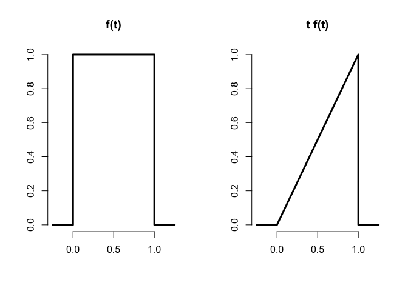
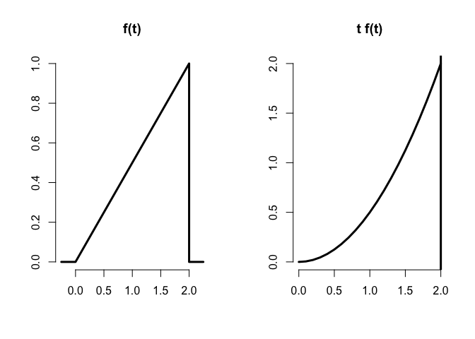
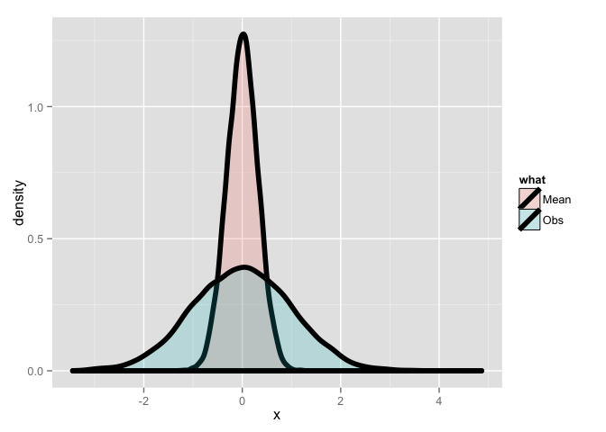
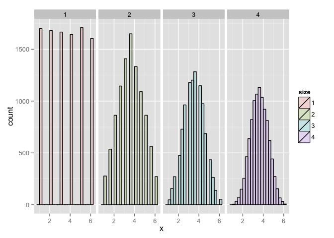

# Expectations

[Source](https://github.com/swirldev/swirl_courses/tree/master/Statistical_Inference/Expectations)


In this lesson, as you might expect, we'll discuss expected values. Expected values of what, exactly?

The expected value of a random variable X, E(X), is a measure of its central tendency. For a discrete random variable X with PMF p(x), E(X) is defined as a sum, over all possible values x, of the quantity x*p(x). E(X) represents the center of mass of a collection of locations and weights, {x, p(x)}.

Another term for expected value is mean. Recall your high school definition of arithmetic mean (or average) as the sum of a bunch of numbers divided by the number of numbers you added together. This is consistent with the formal definition of E(X) if all the numbers are equally weighted.

Consider the random variable X representing a roll of a fair dice. By 'fair' we mean all the sides are equally likely to appear. What is the expected value of X?


```r
sum(c(1:6) * dice_fair)
```

```
## [1] 3.5
```

We've defined a function for you, expect_dice, which takes a PMF as an input. For our purposes, the PMF is a 6-long array of fractions. The i-th entry in the array represents the probability of i being the outcome of a dice roll. Look at the function expect_dice now.


```r
expect_dice
```

```
## function(pmf){ mu <- 0; for (i in 1:6) mu <- mu + i*pmf[i]; mu}
```

We've also defined PMFs for three dice, dice_fair, dice_high and dice_low. The last two are loaded, that is, not fair. Look at dice_high now.


```r
dice_high
```

```
## [1] 0.04761905 0.09523810 0.14285714 0.19047619 0.23809524 0.28571429
```

Using the function expect_dice with dice_high as its argument, calculate the expected value of a roll of dice_high.


```r
expect_dice(dice_high)
```

```
## [1] 4.333333
```

See how the expected value of dice_high is higher than that of the fair dice. Now calculate the expected value of a roll of dice_low.


```r
expect_dice(dice_low)
```

```
## [1] 2.666667
```

You can see the effect of loading the dice on the expectations of the rolls. For high-loaded dice the expected value of a roll (on average) is 4.33 and for low-loaded dice 2.67. We've stored these off for you in two variables, edh and edl. We'll need them later.

 One of the nice properties of the expected value operation is that it's linear. This means that, if c is a constant, then E(cX) = c*E(X). Also, if X and Y are two random variables then E(X+Y)=E(X)+E(Y). It follows that E(aX+bY)=aE(X)+bE(Y).
 
 Suppose you were rolling our two loaded dice, dice_high and dice_low. You can use this linearity property of expectation to compute the expected value of their average. Let X_hi and X_lo  represent the respective outcomes of the dice roll. The expected value of the average is E((X_hi + X_lo)/2) or .5 *( E(X_hi)+E(X_lo) ). Compute this now. Remember we stored the expected values in edh and edl.


```r
.5 * (edh + edl)
```

```
## [1] 3.5
```

For a continuous random variable X, the expected value is defined analogously as it was for the discrete case. Instead of summing over discrete values, however, the expectation integrates over a continuous function.

It follows that for continuous random variables, E(X) is the area under the function t*f(t), where f(t) is the PDF (probability density function) of X. This definition borrows from the definition of center of mass of a continuous body.

Here's a figure from the slides. It shows the constant (1) PDF on the left and the graph of t*f(t) on the right.


```r
par(mfrow = c(1, 2))
plot(c(-0.25, 0, 0, 1, 1, 1.25), c(0, 0, 1, 1, 0, 0), type = "l", lwd = 3, frame = FALSE, xlab="", ylab = ""); title('f(t)')
plot(c(-0.25, 0, 1, 1, 1.25), c(0, 0, 1, 0, 0), type = "l", lwd = 3, frame = FALSE, xlab="", ylab = ""); title('t f(t)')
```

 

Knowing that the expected value is the area under the triangle, t*f(t), what is the expected value of the random variable with this PDF?

* 1: 2.0
* 2: 1.0
* 3: .25
* `4: .5`

For the purposes of illustration, here's another figure using a PDF from our previous probability lesson. It shows the triangular PDF f(t) on the left and the parabolic t*f(t) on the right. The area under the parabola between 0 and 2 represents the expected value of the random variable with this PDF.


```r
par(mfrow = c(1, 2))
plot(c(-0.25, 0, 2, 2, 2.25), c(0, 0, 1, 0, 0), type = "l", lwd = 3, frame = FALSE, xlab="", ylab = ""); title('f(t)')
my_x <- seq(0,2,by=.1)
my_y <- my_x^2/2
plot(my_y ~ my_x, type = "l", lwd = 3, frame = FALSE, xlab="", ylab = ""); title('t f(t)')
abline(v=2.0, lwd=3)
```

 

To find the expected value of this random variable you need to integrate the function t*f(t). Here f(t)=t/2, the diagonal line. (You might recall this from the last probability lesson.) The function you're integrating over is therefore t^2/2. We've defined a function myfunc for you representing this. You can use the R function 'integrate' with parameters myfunc, 0 (the lower bound), and 2 (the upper bound) to find the expected value. Do this now.


```r
integrate(myfunc, 0, 2)
```

```
## 1.333333 with absolute error < 1.5e-14
```

As all the examples have shown, expected values of distributions are useful in characterizing them. The mean characterizes the central tendency of the distribution. However, often populations are too big to measure, so we have to sample them and then we have to use sample means. That's okay because sample expected values estimate the population versions. We'll show this first with a very simple toy and then with some simple equations.

We've defined a small population of 5 numbers for you, spop. Look at it now.


```r
spop
```

```
## [1]  1  4  7 10 13
```

The R function mean will give us the mean of spop. Do this now.


```r
mean(spop)
```

```
## [1] 7
```

Suppose spop were much bigger and we couldn't measure its mean directly and instead had to sample it with samples of size 2. There are 10 such samples, right? We've stored this for you in a 10 x 2 matrix, allsam. Look at it now.


```r
allsam
```

```
##       [,1] [,2]
##  [1,]    1    4
##  [2,]    1    7
##  [3,]    1   10
##  [4,]    1   13
##  [5,]    4    7
##  [6,]    4   10
##  [7,]    4   13
##  [8,]    7   10
##  [9,]    7   13
## [10,]   10   13
```

Each of these 10 samples will have a mean, right? We can use the R function apply to calculate the mean of each row of the matrix allsam. We simply call apply with the arguments allsam, 1, and mean. The second argument, 1, tells 'apply' to apply the third argument 'mean' to the rows of the matrix. Try this now.


```r
apply(allsam, 1, FUN = mean)
```

```
##  [1]  2.5  4.0  5.5  7.0  5.5  7.0  8.5  8.5 10.0 11.5
```

You can see from the resulting vector that the sample means vary a lot, from 2.5 to 11.5, right? Not unexpectedly, the sample mean depends on the sample. However if we take the expected value of these sample means we'll see something amazing. We've stored the sample means in the array smeans for you. Use the R function mean on the array smeans now.


```r
mean(smeans)
```

```
## [1] 7
```

Look familiar? The result is the same as the mean of the original population spop. This is not because the example was specially cooked. **It would work on any population. The expected value or mean of the sample mean is the population mean. What this means is that the sample mean is an unbiased estimator of the population mean.**

Formally, an estimator e of some parameter v is unbiased if its expected value equals v, i.e., E(e)=v. We can show that the expected value of a sample mean equals the population mean with some simple algebra.

Let X_1, X_2, ... X_n be a collection of n samples from a population with mean mu. The mean of these is (X_1 + X_2 + ... + X_n)/n.

What's the expected value of the mean? Recall that E(aX)=aE(X), so E( (X_1+..+X_n)/n ) =

1/n * (E(X_1) + E(X_2) + ... + E(X_n)) = (1/n)*n*mu = mu. Each E(X_i) equals mu since X_i is drawn from the population with mean mu. We expect, on average, a random X_i will equal mu.

Now that was theory.  We can also show this empirically with more simulations.

Here's another figure from the slides. It shows how a sample mean and the mean of averages spike together. The two shaded distributions come from the same data. The blue portion represents the density function of randomly generated standard normal data, 100000 samples. The pink portion represents the density function of 10000 averages, each of 10 random normals. (The original data was stored in a 10000 x 10 array and the average of each row was taken to generate the pink data.)


```r
library(ggplot2)
nosim <- 10000; n <- 10
dat <- data.frame(
  x = c(rnorm(nosim), apply(matrix(rnorm(nosim * n), nosim), 1, mean)),
  what = factor(rep(c("Obs", "Mean"), c(nosim, nosim))) 
)
np <- ggplot(dat, aes(x = x, fill = what)) + geom_density(size = 2, alpha = .2); 
print(np)
```

 

Here's another figure from the slides. Rolling a single die 10000 times yields the first figure. Each of the 6 possible outcomes appears with about the same frequency. The second figure is the histogram of outcomes of the average of rolling two dice. Similarly, the third figure is the histogram of averages of rolling three dice, and the fourth four dice. As we showed previously, the center or mean of the original distribution is 3.5 and that's exactly where all the panels are centered.


```r
dat <- data.frame(
  x = c(sample(1 : 6, nosim, replace = TRUE),
        apply(matrix(sample(1 : 6, nosim * 2, replace = TRUE), 
                     nosim), 1, mean),
        apply(matrix(sample(1 : 6, nosim * 3, replace = TRUE), 
                     nosim), 1, mean),
        apply(matrix(sample(1 : 6, nosim * 4, replace = TRUE), 
                     nosim), 1, mean)
  ),
  size = factor(rep(1 : 4, rep(nosim, 4))))
g <- ggplot(dat, aes(x = x, fill = size)) + geom_histogram(alpha = .20, binwidth=.25, colour = "black") 
g <- g + facet_grid(. ~ size)
print(g)
```

 

Let's recap. Expected values are properties of distributions. The average, or mean, of random variables is itself a random variable and its associated distribution itself has an expected value. The center of this distribution is the same as that of the original distribution.

Expected values are properties of what?

* 1: fulcrums
* 2: variances
* `3: distributions`
* 4: demanding parents

A population mean is a center of mass of what?

* 1: a family
* `2: a population`
* 3: a distribution
* 4: a sample

A sample mean is a center of mass of what?

* 1: a population
* 2: a distribution
* `3: observed data`
* 4: a family

True or False? A population mean estimates a sample mean.

* 1: True
* `2: False`

True or False? A sample mean is unbiased.
(The sample mean is the population mean, so by definition it's unbiased.)

* `1: True`
* 2: False

True or False? The more data that goes into the sample mean, the more concentrated its density / mass function is around the population mean.

* 1: False
* `2: True`
