# Expectations

[Source](https://github.com/swirldev/swirl_courses/tree/master/Statistical_Inference/Asymptotics)


In this lesson, we'll discuss asymptotics, a topic which describes how statistics behave as sample sizes get very large and approach infinity. Pretending sample sizes and populations are infinite is useful for making statistical inferences and approximations since it often leads to a nice understanding of procedures.

Asymptotics generally give no assurances about finite sample performance, but they form the basis for frequency interpretation of probabilities (the long run proportion of times an event occurs).

Recall our simulations and discussions of sample means in previous lessons. We can now talk about the distribution of sample means of a collection of iid observations. The mean of the sample mean estimates what?

```
population mean
```

The Law of Large Numbers (LLN) says that the average (mean) approaches what it's estimating. We saw in our simulations that the larger the sample size the better the estimation.  As we flip a fair coin over and over, it eventually converges to the true probability of a head (.5).

The LLN forms the basis of frequency style thinking.

To see this in action, we've copied some code from the slides and created the function coinPlot. It takes an integer n which is the number of coin tosses that will be simulated. As coinPlot does these coin flips it computes the cumulative sum (assuming heads are 1 and tails 0), but after each toss it divides the cumulative sum by the number of flips performed so far. It then plots this value for each of the k=1...n tosses. Try it now for n=10.


```r
coinPlot(10)
```

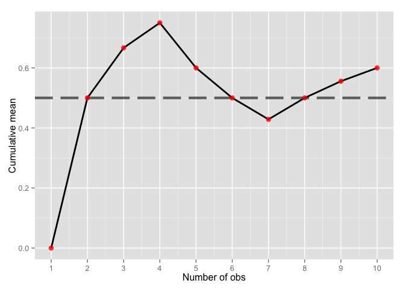 

Your output depends on R's random number generator, but your plot probably jumps around a bit and, by the 10th flip, your cumulative sum/10 is probably different from mine. If you did this several times, your plots would vary quite a bit. Now call coinPlot again, this time with 10000 as the argument.


```r
coinPlot(10000)
```

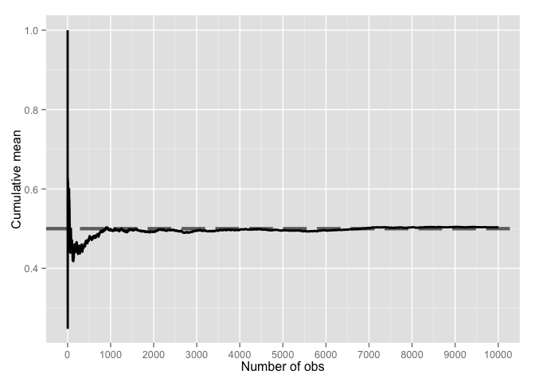 

See the difference? Asymptotics in Action! The line approaches its asymptote of .5. This is the probability you expect since what we're plotting, the cumulative sum/number of flips, represents the probability of the coin landing on heads. As we know, this is .5 .

We say that an estimator is CONSISTENT if it converges to what it's trying to estimate. The LLN says that the sample mean of iid samples is consistent for the population mean. This is good, right?

Based on our previous lesson do you think the sample variance (and hence sample deviation) are consistent as well?

```
Yes
```

Now for something really important - the CENTRAL LIMIT THEOREM (CLT) - one of the most important theorems in all of statistics. It states that the distribution of averages of iid variables (properly normalized) becomes that of a standard normal as the sample size increases.

Let's dissect this to see what it means. First, 'properly normalized' means that you transformed the sample mean X'. You subtracted the population mean mu from it and divided the difference by sigma/sqrt(n). Here sigma is the standard deviation of the population and n is the sample size.

Second, the CLT says that for large n, this normalized variable, (X'-mu)/(sigma/sqrt(n)) is almost normally distributed with mean 0 and variance 1. Remember that n must be large for the CLT to apply.

Do you recognize sigma/sqrt(n) from our lesson on variance? Since the population std deviation sigma is unknown, sigma/sqrt(n) is often approximated by what?

(Recall our many simulation experiments in the variance lesson where we calculated standard deviations of means using R's sd function, then we calculated an approximation using a formula involving the population variance and the square root of the sample size.)

```
the standard error of the sample mean
```

Let's rephrase the CLT. Suppose X_1, X_2, ... X_n are independent, identically distributed random variables from an infinite population with mean mu and variance sigma^2. Then if n is large, the mean of the X's, call it X', is approximately normal with mean mu and variance sigma^2/n. We denote this as `X'~N(mu,sigma^2/n)`.

To show the CLT in action consider this figure from the slides. It presents 3 histograms of 1000 averages of dice rolls with sample sizes of 10, 20 and 30 respectively. Each average of n dice rolls (n=10,20,30) has been normalized by subtracting off the mean (3.5) then dividing by the standard error, sqrt(2.92/n). The normalization has made each histogram look like a standard normal, i.e., mean 0 and standard deviation 1.


```r
nosim <- 1000
cfunc <- function(x, n) sqrt(n) * (mean(x) - 3.5) / 1.71
dat <- data.frame(
  x = c(apply(matrix(sample(1 : 6, nosim * 10, replace = TRUE), 
                     nosim), 1, cfunc, 10),
        apply(matrix(sample(1 : 6, nosim * 20, replace = TRUE), 
                     nosim), 1, cfunc, 20),
        apply(matrix(sample(1 : 6, nosim * 30, replace = TRUE), 
                     nosim), 1, cfunc, 30)
  ),
  size = factor(rep(c(10, 20, 30), rep(nosim, 3))))
g <- ggplot(dat, aes(x = x, fill = size)) + geom_histogram(alpha = .20, binwidth=.3, colour = "black", aes(y = ..density..)) 
g <- g + stat_function(fun = dnorm, size = 2)
g <- g + facet_grid(. ~ size)
print(g)
```

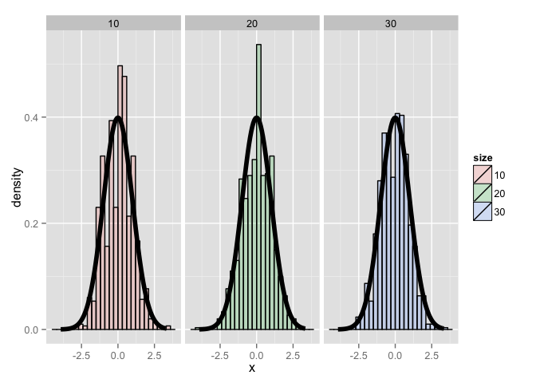 

Notice that the CLT said nothing about the original population being normally distributed. That's precisely where its usefulness lies! We can assume normality of a population mean no matter what kind of population we have, as long as our sample size is large enough and our samples are independent. Let's look at how it works with a binomial experiment like flipping a coin.

Recall that if the probability of a head (call it 1) is p, then the probability of a tail (0) is 1-p. The expected value then is p and the variance is p-p^2 or p(1-p). Suppose we do n coin flips and let p' represent the average of these n flips. We normalize p' by subtracting the mean p and dividing by the std deviation sqrt(p(1-p)/n). Let's do this for 1000 trials and plot the resulting histogram.

Here's a figure from the slides showing the results of 3 such trials where each trial is for a different value of n (10, 20, and 30) and the coin is fair,so E(X)=.5 and the standard error is 1/(2sqrt(n)). Notice how with larger n (30) the histogram tightens up around the mean 0.


```r
nosim <- 1000
cfunc <- function(x, n) 2 * sqrt(n) * (mean(x) - 0.5) 
dat <- data.frame(
  x = c(apply(matrix(sample(0:1, nosim * 10, replace = TRUE), 
                     nosim), 1, cfunc, 10),
        apply(matrix(sample(0:1, nosim * 20, replace = TRUE), 
                     nosim), 1, cfunc, 20),
        apply(matrix(sample(0:1, nosim * 30, replace = TRUE), 
                     nosim), 1, cfunc, 30)
  ),
  size = factor(rep(c(10, 20, 30), rep(nosim, 3))))
g <- ggplot(dat, aes(x = x, fill = size)) + geom_histogram(binwidth=.3, colour = "black", aes(y = ..density..)) 
g <- g + stat_function(fun = dnorm, size = 2)
g <- g + facet_grid(. ~ size)
print(g)
```

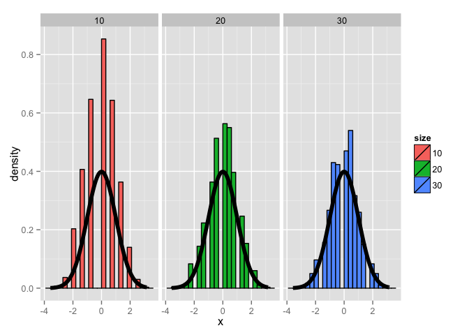 

Here's another plot from the slides of the same experiment, this time using a biassed coin. We set the probability of a head to .9, so E(X)=.9 and the standard error is sqrt(.09/n) Again, the larger the sample size the more closely the distribution looks normal, although with this biassed coin the normal approximation isn't as good as it was with the fair coin.


```r
nosim <- 1000
cfunc <- function(x, n) sqrt(n) * (mean(x) - 0.9) / sqrt(.1 * .9)
dat <- data.frame(
  x = c(apply(matrix(sample(0:1, prob = c(.1,.9), nosim * 10, replace = TRUE), 
                     nosim), 1, cfunc, 10),
        apply(matrix(sample(0:1, prob = c(.1,.9), nosim * 20, replace = TRUE), 
                     nosim), 1, cfunc, 20),
        apply(matrix(sample(0:1, prob = c(.1,.9), nosim * 30, replace = TRUE), 
                     nosim), 1, cfunc, 30)
  ),
  size = factor(rep(c(10, 20, 30), rep(nosim, 3))))
g <- ggplot(dat, aes(x = x, fill = size)) + geom_histogram(binwidth=.3, colour = "black", aes(y = ..density..)) 
g <- g + stat_function(fun = dnorm, size = 2)
g <- g + facet_grid(. ~ size)
print(g)
```

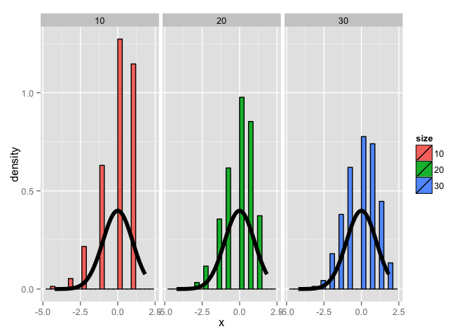 

Now let's talk about confidence intervals.

We know from the CLT that for large n, the sample mean is normal with mean mu and standard deviation sigma/sqrt(n). We also know that 95% of the area under a normal curve is within two standard deviations of the mean. This figure, a standard normal with mu=0 and sigma=1, illustrates this point; the entire shaded portion depicts the area within 2 standard deviations of the mean and the darker portion shows the 68% of the area within 1 standard deviation.


```r
x <- seq(-4, 4, length = 1000)
dat <- data.frame(x=x, y=dnorm(x))
g <- ggplot(dat, 
            aes(x = x, y = y)) + geom_line(size = 1.5)
g <- g+ layer("area",mapping = aes(x=ifelse(x>-1 & x<1,x,0)),
            geom_params=list(fill="red",alpha=1)) +
   scale_y_continuous(limits=c(0,max(dat$y)))
g <- g+   layer("area",mapping = aes(x=ifelse(x>-2 & x<2 ,x,0)),
                geom_params=list(fill="red",alpha=0.5))
#g <- g+   layer("area",mapping = aes(x=ifelse(x>-3 & x<3 ,x,0)),
 #              geom_params=list(fill="red",alpha=0.35))
print(g)
```

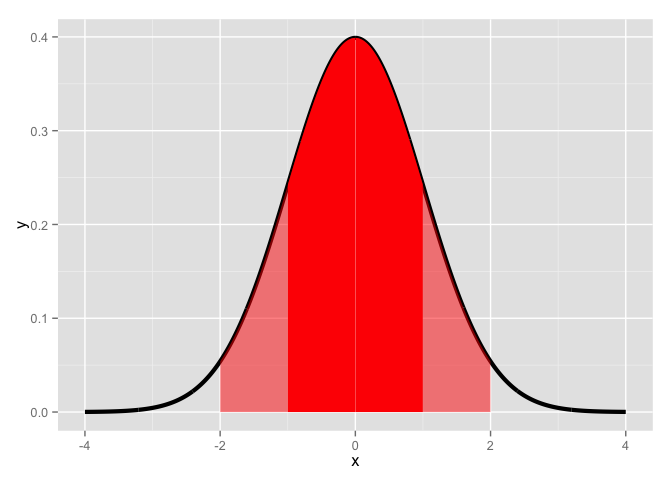 

It follows that 5% of the area under the curve is not shaded. By symmetry of the curve, only 2.5% of the data is greater than the mean + 2 standard deviations `(mu+2*sigma/sqrt(n))` and only 2.5% is less than the mean - 2 standard deviations `(mu-2*sigma/sqrt(n))`.

So the probability that the sample mean X' is bigger than mu + 2sigma/sqrt(n) OR smaller than `mu-2sigma/sqrt(n)` is 5%.  Equivalently, the probability of being between these limits is 95%. Of course we could have different sizes of intervals. If we wanted something other than 95, then we would use a quantile other than 2.

The quantity X' plus or minus 2 sigma/sqrt(n) is called a 95% interval for mu. The 95% says that if one were to repeatedly get samples of size n, about 95% of the intervals obtained would  contain mu, the quantity we're trying to estimate.

Note that for a 95% confidence interval we divide (100-95) by 2 (since we have both left and right tails) and add the result to 95 to compute the quantile we need. The 97.5 quantile is actually 1.96, but for simplicity it's often just rounded up to 2. If you wanted to find a 90% confidence interval what quantile would you want?


```r
(100-90)/2 + 90
```

```
## [1] 95
```

Use the R function qnorm to find the 95th quantile for a standard normal distribution. Remembe that qnorm takes a probability as an input. You can use default values for all the other arguments.


```r
qnorm(.95)
```

```
## [1] 1.644854
```

As we've seen before, in a binomial distribution in which p represents the probability or proportion of success, the variance sigma^2 is p(1-p), so the standard error of the sample mean p' is sqrt(p(1-p)/n) where n is the sample size. The 95% confidence interval of p is then p' +/- 2*sqrt(p(1-p)/n). The 2 in this formula represents what?

```
the approximate 975% normal quantile
```

A critical point here is that we don't know the true value of p; that's what we're trying to estimate. How can we compute a confidence interval if we don't know p(1-p)? We could be conservative and try to maximize it so we get the largest possible confidence interval. Calculus tells us that p(1-p) is maximized when p=1/2, so we get the biggest 95% confidence interval when we set p=1/2 in the formula p'+/- 2*sqrt(p(1-p)/n).

Using 1/2 for the value of p in the formula above yields what expression for the 95% confidence interval for p?

(p(1-p)=1/4 when p=1/2 and the sqrt(1/4n)=1/(2*sqrt(n)). What happens when you multiply this by 2?)

```
p'+/- 1/sqrt(n)
```

Here's another example of applying this formula from the slides. Suppose you were running for office and your pollster polled 100 people. Of these 60 claimed they were going to vote for you. You'd like to estimate the true proportion of people who will vote for you and you want to be 95% confident of your estimate. We need to find the limits that will contain the true proportion of your supporters with 95% confidence, so we'll use the formula p' +/- 1/sqrt(n) to answer this question. First, what value would you use for p', the sampled estimate?

The only sampled number here is the number of people who said they would vote for you. Make it a proportion by dividing it by the sample size.

```
.60
```

What would you use for 1/sqrt(n)?

```
1/10
```

The bounds of the interval then are what?

(We know p'- 1/sqrt(n) is the lower bound and p'+ 1/sqrt(n) is the upper bound, so use the answers from the two previous answers to fill in values for these variables.)

```
.5 and .7
```

How do you feel about the election?

(With 95% confidence, between .5 and .7 of the voters support you. You look like a winner to me!)

```
confident
```

Another technique for calculating confidence intervals for binomial distributions is to replace p with p'. This is called the Wald confidence interval. We can also use the R function qnorm to get a more precise quantile value (closer to 1.96) instead of our ballpark estimate of 2.

With the formula p'+/- qnorm(.975)*sqrt(p'(1-p')/100), use the p' and n values from above and the R construct p'+c(-1,1)... to handle the plus/minus portion of the formula. You should see bounds similar to the ones you just estimated.


```r
.6 + c(-1,1) * qnorm(.975) * sqrt(.6 * (1-.6)/100)
```

```
## [1] 0.5039818 0.6960182
```

As an alternative to this Wald interval, we can also use the R function binom.test with the parameters 60 and 100 and let all the others default. This function "performs an exact test of a simple null hypothesis about the probability of success in a Bernoulli experiment." (This means it guarantees the coverages, uses a lot of computation and doesn't rely on the CLT.) This function returns a lot of information but all we want now are the values of the confidence interval that it returns. Use the R construct x$conf.int to find these now.


```r
binom.test(60, 100)$conf.int
```

```
## [1] 0.4972092 0.6967052
## attr(,"conf.level")
## [1] 0.95
```

Close to what we've seen before, right? Now we're going to see that the Wald interval isn't very accurate when n is small. We'll use the example from the slides.

Suppose we flip a coin a small number of times, say 20. Also suppose we have a function mywald which takes a probability p, and generates 30 sets of 20 coin flips using that probability p. It uses the sampled proportion of success, p', for those 20 coin flips to compute the upper and lower bounds of the 95% Wald interval, that is, it computes the two numbers p'+/- qnorm(.975) * sqrt(p' * (1-p') / n) for each of the 30 trials. For the given true probability p, we count the number of times out of those 30 trials that the true probability p was in the Wald confidence interval. We'll call this the coverage.


```r
n <- 20
nosim <- 30
mywald <- function(p){
  phats <- rbinom(nosim, prob = p, size = n) / n
  ll <- phats - qnorm(.975) * sqrt(phats * (1 - phats) / n)
  ul <- phats + qnorm(.975) * sqrt(phats * (1 - phats) / n)
  print("Here are the p\' values")
  print(phats)
  print("Here are the lower")
  print(ll)
  print("Here are the upper")
  print(ul)
  mean(ll < p & ul > p)
}
```

To make sure you understand what's going on, try running mywald now with the probability .2. It will print out 30 p' values (which you don't really need to see), followed by 30 lower bounds, 30 upper bounds and lastly the percentage of times that the input .2 was between the two bounds. See if you agree with the percentage you get. Usually it suffices to just count the number of times (out of the 30) that .2 is less than the upper bound.


```r
mywald(.2)
```

```
## [1] "Here are the p' values"
##  [1] 0.10 0.30 0.10 0.35 0.15 0.05 0.20 0.25 0.30 0.05 0.30 0.20 0.20 0.35
## [15] 0.30 0.25 0.35 0.10 0.15 0.20 0.10 0.15 0.15 0.20 0.10 0.20 0.10 0.25
## [29] 0.10 0.15
## [1] "Here are the lower"
##  [1] -0.031478381  0.099163455 -0.031478381  0.140962697 -0.006490575
##  [6] -0.045516829  0.024695492  0.060227303  0.099163455 -0.045516829
## [11]  0.099163455  0.024695492  0.024695492  0.140962697  0.099163455
## [16]  0.060227303  0.140962697 -0.031478381 -0.006490575  0.024695492
## [21] -0.031478381 -0.006490575 -0.006490575  0.024695492 -0.031478381
## [26]  0.024695492 -0.031478381  0.060227303 -0.031478381 -0.006490575
## [1] "Here are the upper"
##  [1] 0.2314784 0.5008365 0.2314784 0.5590373 0.3064906 0.1455168 0.3753045
##  [8] 0.4397727 0.5008365 0.1455168 0.5008365 0.3753045 0.3753045 0.5590373
## [15] 0.5008365 0.4397727 0.5590373 0.2314784 0.3064906 0.3753045 0.2314784
## [22] 0.3064906 0.3064906 0.3753045 0.2314784 0.3753045 0.2314784 0.4397727
## [29] 0.2314784 0.3064906
```

```
## [1] 0.9333333
```

Now that you understand the underlying principle, suppose instead of 30 trials, we used 1000 trials. Also suppose we did this experiment for a series of probabilities, say from .1 to .9 taking steps of size .05. More specifically, we'll call our function using 17 different probabilities, namely .1, .15, .2, .25, ... .9 . We can then plot the percentages of coverage for each of the probabilities.

Here's the plot of our results. Each of the 17 vertices show the percentage of coverage for a particular true probability p passed to the function. Results will vary, but usually the only probability that hits close to or above the 95% line is the p=.5 . So this shows that when n, the number of flips, is small (20) the CLT doesn't hold for many values of p, so the Wald interval doesn't work very well.


```r
n <- 20; pvals <- seq(.1, .9, by = .05); nosim <- 1000
coverage <- sapply(pvals, function(p){
  phats <- rbinom(nosim, prob = p, size = n) / n
  ll <- phats - qnorm(.975) * sqrt(phats * (1 - phats) / n)
  ul <- phats + qnorm(.975) * sqrt(phats * (1 - phats) / n)
  mean(ll < p & ul > p)
})
g <- ggplot(data.frame(pvals, coverage), aes(x = pvals, y = coverage)) + geom_line(size = 2) + geom_hline(yintercept = 0.95) + ylim(.75, 1.0)
print(g)
```

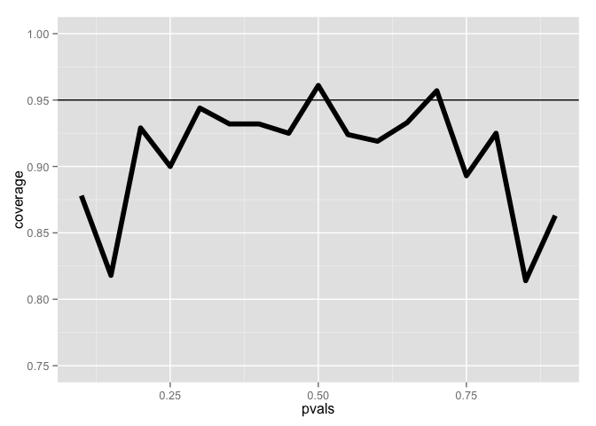 

Let's try the same experiment and increase n, the number of coin flips in each of our 1000 trials, from 20 to 100 to see if the plot improves. Again, results may vary, but all the probabilities are much closer to the 95% line, so the CLT works better with a bigger value of n.


```r
n <- 100; pvals <- seq(.1, .9, by = .05); nosim <- 1000
coverage <- sapply(pvals, function(p){
  phats <- rbinom(nosim, prob = p, size = n) / n
  ll <- phats - qnorm(.975) * sqrt(phats * (1 - phats) / n)
  ul <- phats + qnorm(.975) * sqrt(phats * (1 - phats) / n)
  mean(ll < p & ul > p)
})
g <- ggplot(data.frame(pvals, coverage), aes(x = pvals, y = coverage)) + geom_line(size = 2) + geom_hline(yintercept = 0.95) + ylim(.75, 1.0)
print(g)
```

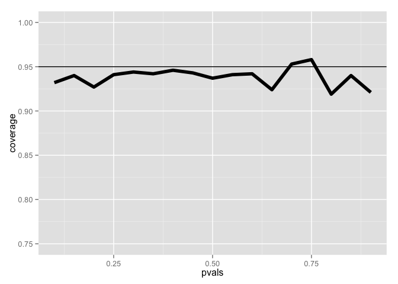 

A quick fix to the problem of having a small n is to use the Agresti/Coull interval. This simply means we add 2 successes and 2 failures to the counts when calculating the proportion p'. Specifically, if X is the number of successes out of the 20 coin flips, then instead of setting p'=X/20, let p'=(X+2)/24. We use 24 as the number of trials since we've added 2 successes and 2 failures to the counts. Note that we still use 20 in the calculation of the upper and lower bounds.

Here's a plot using this Agresti/Coull interval, with 1000 trials of 20 coin flips each. It looks much better than both the original Wald with 20 coin flips and the improved Wald with 100 coin flips. However, this technique might make the confidence interval too wide.


```r
n <- 20; pvals <- seq(.1, .9, by = .05); nosim <- 1000
coverage <- sapply(pvals, function(p){
  phats <- (rbinom(nosim, prob = p, size = n) + 2) / (n + 4)
  ll <- phats - qnorm(.975) * sqrt(phats * (1 - phats) / n)
  ul <- phats + qnorm(.975) * sqrt(phats * (1 - phats) / n)
  mean(ll < p & ul > p)
})
g <- ggplot(data.frame(pvals, coverage), aes(x = pvals, y = coverage)) + geom_line(size = 2) + geom_hline(yintercept = 0.95) + ylim(.75, 1.0)
print(g)
```

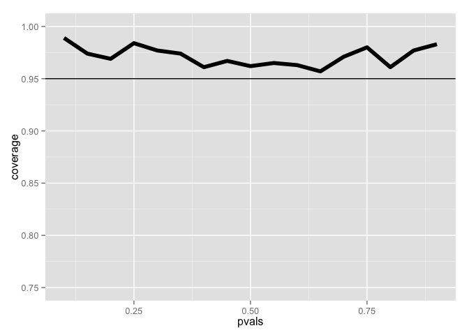 

Why does this work? Adding 2 successes and 2 failures pulls p' closer to .5 which, as we saw, is the value which maximizes the confidence interval.

To show this simply, we wrote a function ACCompar, which takes an integer input n. For each k from 1 to n it computes two fractions, k/n and (k+2)/(n+4). It then prints out the boolean vector of whether the new (k+2)/(n+4) fraction is less than the old k/n. It also prints out the total number of k's for which the condition is TRUE.


```r
ACCompar <- function(n){
 num <- 1:n 
 den <- n
 nn <- num+2
 nd <- den+4
 nf <- nn/nd
 of <- num/den
 scor <- nf<of
 print(scor)
 sum(scor)
}
```

For all k less than n/2, you see FALSE indicating that the new fraction is greater than or equal to k/n. For all k greater than n/2 you see TRUE indicating that the new fraction is less than the old. If k=n/2 the old and new fractions are equal.

Try running ACCompar now with an input of 20.


```r
ACCompar(20)
```

```
##  [1] FALSE FALSE FALSE FALSE FALSE FALSE FALSE FALSE FALSE FALSE  TRUE
## [12]  TRUE  TRUE  TRUE  TRUE  TRUE  TRUE  TRUE  TRUE  TRUE
```

```
## [1] 10
```

Let's move on to Poisson distributions and confidence intervals. Recall that Poisson distributions apply to counts or rates. For the latter, we write X~Poisson(lambda*t) where lambda is the expected count per unit of time and t is the total monitoring time.

Here's another example from the slides. Suppose a nuclear pump failed 5 times out of 94.32 days and we want a 95% confidence interval for the failure rate per day. The number of failures X is Poisson distributed with parameter (lambda*t). We don't observe the failure rate, but we estimate it as x/t. Call our estimate lambda_hat, so lambda_hat=x/t. According to theory, the variance of our estimated failure rate is lambda/t. Again, we don't observe lamdba, so we use our estimate of it instead. We thus approximate the variance of lambda_hat as lambda_hat/t.

```
5/94.32
```

Set a variable lamb now with this value.


```r
lamb <- 5/94.32
```

So lamb is our estimated mean and lamb/t is our estimated variance. The formula we've used to calculate a 95% confidence interval is est mean + c(-1,1)*qnorm(.975)*sqrt(est var). Use this formula now making the appropriate substitutions.


```r
lamb +c(-1,1) * qnorm(.975) * sqrt(lamb/94.32)
```

```
## [1] 0.006545667 0.099476386
```

As a check we can use R's function poisson.test with the arguments 5 and 94.32 to check this result. This is an exact test so it guarantees coverage. As with the binomial exact test, we only need to look at the conf portion of the result using the x$conf construct. Do this now.


```r
poisson.test(5, 94.32)$conf
```

```
## [1] 0.01721254 0.12371005
## attr(,"conf.level")
## [1] 0.95
```

Pretty close, right? Now to check the coverage of our estimate we'll run the same simulation experiment we ran before with binomial distributions. We'll vary our lambda values from .005 to .1 with steps of .01 (so we have 10 of them), and for each one we'll generate 1000 Poisson samples with mean lambda*t. We'll calculate sample means and use them to compute 95% confidence intervals. We'll then count how often out of the 1000 simulations the true mean (our lambda) was contained in the computed interval.

Here's a plot of the results. We see that the coverage improves as lambda gets larger, and it's quite off for small lambda values.


```r
lambdavals <- seq(0.005, 0.10, by = .01); nosim <- 1000
t <- 100
coverage <- sapply(lambdavals, function(lambda){
  lhats <- rpois(nosim, lambda = lambda * t) / t
  ll <- lhats - qnorm(.975) * sqrt(lhats / t)
  ul <- lhats + qnorm(.975) * sqrt(lhats / t)
  mean(ll < lambda & ul > lambda)
})
g <- ggplot(data.frame(lambdavals, coverage), aes(x = lambdavals, y = coverage)) + geom_line(size = 2) + geom_hline(yintercept = 0.95)+ylim(0, 1.0)
print(g)
```

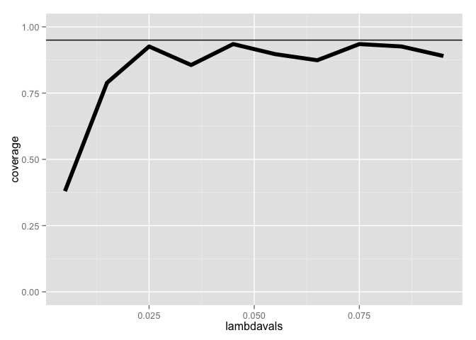 

Now it's interesting to see how the coverage improves when we increase the unit of time. In the previous plot we used t=100 (rounding the 94.32 up). Here's a plot of the same experiment setting t=1000. We see that the coverage is much better for almost all the values of lambda, except for the smallest ones.


```r
lambdavals <- seq(0.005, 0.10, by = .01); nosim <- 1000
t <- 1000
coverage <- sapply(lambdavals, function(lambda){
  lhats <- rpois(nosim, lambda = lambda * t) / t
  ll <- lhats - qnorm(.975) * sqrt(lhats / t)
  ul <- lhats + qnorm(.975) * sqrt(lhats / t)
  mean(ll < lambda & ul > lambda)
})
g <- ggplot(data.frame(lambdavals, coverage), aes(x = lambdavals, y = coverage)) + geom_line(size = 2) + geom_hline(yintercept = 0.95)+ylim(0, 1.0)
print(g)
```

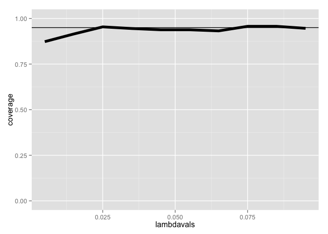 

Now for a quick review!

What tells us that averages of iid samples converge to the population means that they are estimating?

```
the law of large numbers
```

What tells us that averages are approximately normal for large enough sample sizes

```
the CLT
```

The Central Limit Theorem (CLT) tells us that averages have what kind of distributions?

```
normal
```

The Central Limit Theorem (CLT) tells us that averages have normal distributions centered at what?

```
the population mean
```

The Central Limit Theorem (CLT) tells us that averages have normal distributions with standard deviations equal to what?

```
the standard error
```

True or False - The Central Limit Theorem (CLT) tells us that averages always have normal distributions no matter how big the sample size

```
False
```

To calculate a confidence interval for a mean you take the sample mean and add and subtract the relevant normal quantile times the what?

```
standard error
```

For a 95% confidence interval approximately how many standard errors would you add and subtract from the sample mean?

```
3
```

If you wanted increased coverage what would you do to your confidence interval?

```
increase it
```

If you had less variability in your data would your confidence interval get bigger or smaller?

```
smaller
```

If you had larger sample size would your confidence interval get bigger or smaller?

```
smaller
```

A quick fix for small sample size binomial calculations is what?

```
add 2 successes and 2 failures
```


