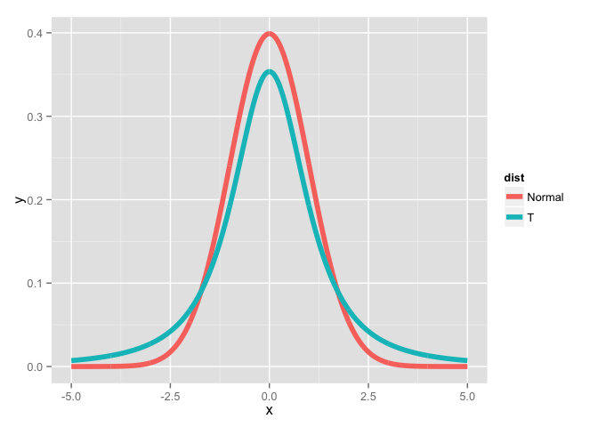
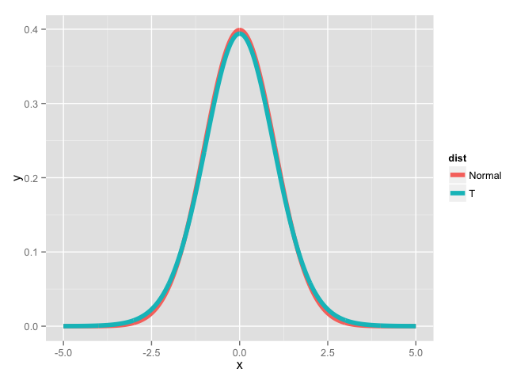
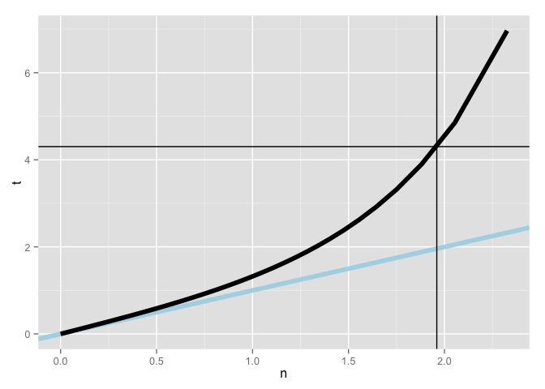
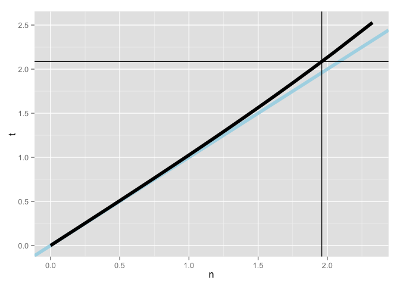
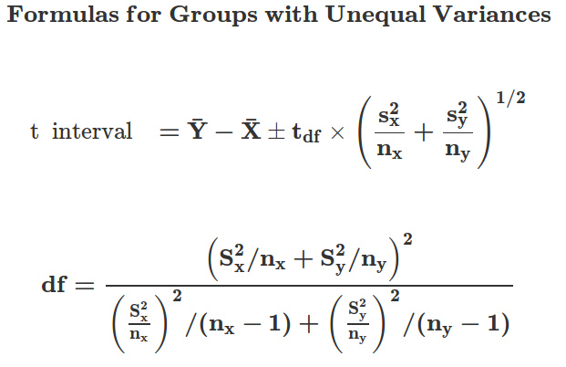

# T Confidence Intervals

[Source](https://github.com/swirldev/swirl_courses/tree/master/Statistical_Inference/T_Confidence_Intervals)


In this lesson, we'll discuss some statistical methods for dealing with small datasets, specifically the Student's or Gosset's t distribution and t confidence intervals.

In the Asymptotics lesson we discussed confidence intervals using the Central Limit Theorem (CLT) and normal distributions. These needed large sample sizes, and the formula for computing the confidence interval was Est +/- qnorm *std error(Est), where Est was some estimated value (such as a sample mean) with a standard error. Here qnorm represented what?

```
a specified quantile from a normal distribution
```

In the Asymptotics lesson we also mentioned the Z statistic Z=(X'-mu)/(sigma/sqrt(n)) which follows a standard normal distribution. This normalized statistic Z is especially nice because we know its mean and variance. They are what, respectively?

```
0 and 1
```

So the mean and variance of the standardized normal are fixed and known. Now we'll define the t statistic which looks a lot like the Z. It's defined as t=(X'-mu)/(s/sqrt(n)). Like the Z statistic, the t is centered around 0. The only difference between the two is that the population std deviation, sigma, in Z is replaced by the sample standard deviation in the t. So **the distribution of the t statistic is independent of the population mean and variance. Instead it depends on the sample size n**.

As a result, for t distributions, the formula for computing a confidence interval is similar to what we did in the last lesson. However, instead of a quantile for a normal distribution we use a quantile for a t distribution. So the formula is `Est +/- t-quantile *std error(Est)`. The other distinction, which we mentioned before, is that we'll use the sample standard deviation when we estimate the standard error of Est.

In the formula for the t statistic `t=(X'-mu)/(s/sqrt(n))` what expression represents the sample standard deviation?

```
s
```

These t confidence intervals are very handy, and if you have a choice between these and normal, pick these. We'll see that as datasets get larger, t-intervals look normal. We'll cover the one- and two-group versions which depend on the data you have.

**The t distribution, invented by William Gosset in 1908, has thicker tails than the normal. Also, instead of having two parameters, mean and variance, as the normal does, the t distribution has only one - the number of degrees of freedom (df).**

As df increases, the t distribution gets more like a standard normal, so it's centered around 0. Also, the t assumes that the underlying data are iid Gaussian so the statistic `(X' - mu)/(s/sqrt(n))` has n-1 degrees of freedom.

Quick check. In the formula `t=(X' - mu}/(s/sqrt(n))`, if we replaced s by sigma the statistic t would be what asymptotically?.

```
the standard normal
```

To see what we mean, we've taken code from the slides, the function myplot, which takes the integer df as its input and plots the t distribution with df degrees of freedom. It also plots a standard normal distribution so you can see how they relate to one another.

To see what we mean, we've taken code from the slides, the function myplot, which takes the integer df as its input and plots the t distribution with df degrees of freedom. It also plots a standard normal distribution so you can see how they relate to one another.


```r
k <- 1000
xvals <- seq(-5, 5, length = k)
myplot <- function(df){
  d <- data.frame(y = c(dnorm(xvals), dt(xvals, df)),
                  x = xvals,
                  dist = factor(rep(c("Normal", "T"), c(k,k))))
  g <- ggplot(d, aes(x = x, y = y)) 
  g <- g + geom_line(size = 2, aes(colour = dist))
  print(g)
}
```

Try myplot now with an input of 2.


```r
myplot(2)
```

 

You can see that the hump of t distribution (in blue) is not as high as the normal's. Consequently, the two tails of the t distribution absorb the extra mass, so they're thicker than the normal's. Note that with 2 degrees of freedom, you only have 3 data points. Ha! Talk about small sample sizes. Now try myplot with an input of 20.


```r
myplot(20)
```

 

The two distributions are almost right on top of each other using this higher degree of freedom.

Another way to look at these distributions is to plot their quantiles. From the slides, we've provided a second function for you, myplot2, which does this. It plots a lightblue reference line representing normal quantiles and a black line for the t quantiles. Both plot the quantiles starting at the 50th percentile which is 0 (since the distributions are symmetric about 0) and go to the 99th.


```r
pvals <- seq(.5, .99, by = .01)
myplot2 <- function(df){
  d <- data.frame(n= qnorm(pvals),t=qt(pvals, df),
                  p = pvals)
  g <- ggplot(d, aes(x= n, y = t))
  g <- g + geom_abline(size = 2, col = "lightblue")
  g <- g + geom_line(size = 2, col = "black")
  g <- g + geom_vline(xintercept = qnorm(0.975))
  g <- g + geom_hline(yintercept = qt(0.975, df))
  print(g)
}
```

Try myplot2 now with an argument of 2.


```r
myplot2(2)
```

 

The distance between the two thick lines represents the difference in sizes between the quantiles and hence the two sets of intervals. Note the thin horizontal and vertical lines. These represent the .975 quantiles for the t and normal distributions respectively. Anyway, you probably recognized the placement of the vertical at 1.96 from the Asymptotics lesson.


Check the placement of the horizontal now using the R function qt with the arguments .975 for the quantile and 2 for the degrees of freedom (df).


```r
qt(.975, df = 2)
```

```
## [1] 4.302653
```

See? It matches the horizontal line of the plot. Now run myplot2 with an argument of 20.


```r
myplot2(20)
```

 

The quantiles are much closer together with the higher degrees of freedom. At the 97.5 percentile, though, the t quantile is still greater than the normal. Student's Rules!

This means the the t interval is always wider than the normal. This is because estimating the standard deviation introduces more uncertainty so a wider interval results.

So the t-interval is defined as `X' +/- t_(n-1)*s/sqrt(n)` where t_(n-1) is the relevant quantile. The t interval assumes that the data are iid normal, though it is robust to this assumption and works well whenever the distribution of the data is roughly symmetric and mound shaped.

Our plots showed us that for large degrees of freedom, t quantiles become close to what?

```
standard normal quantiles
```

Although it's pretty great, the t interval isn't always applicable. For skewed distributions, the spirit of the t interval assumptions (being centered around 0) are violated. There are ways of working around this problem (such as taking logs or using a different summary like the median).

For highly discrete data, like binary, intervals other than the t are available.

However, paired observations are often analyzed using the t interval by taking differences between the observations. We'll show you what we mean now.

We hope you're not tired because we're going to look at some sleep data. This was the data originally analyzed in Gosset's Biometrika paper, which shows the increase in hours for 10 patients on two soporific drugs.

We've loaded the data for you. R treats it as two groups rather than paired. To see what we mean type sleep now. This will show you how the data is stored.


```r
sleep
```

```
##    extra group ID
## 1    0.7     1  1
## 2   -1.6     1  2
## 3   -0.2     1  3
## 4   -1.2     1  4
## 5   -0.1     1  5
## 6    3.4     1  6
## 7    3.7     1  7
## 8    0.8     1  8
## 9    0.0     1  9
## 10   2.0     1 10
## 11   1.9     2  1
## 12   0.8     2  2
## 13   1.1     2  3
## 14   0.1     2  4
## 15  -0.1     2  5
## 16   4.4     2  6
## 17   5.5     2  7
## 18   1.6     2  8
## 19   4.6     2  9
## 20   3.4     2 10
```

We see 20 entries, the first 10 show the results (extra) of the first drug (group 1) on each of the patients (ID), and the last 10 entries the results of the second drug (group 2) on each patient (ID).

Here we've plotted the data in a paired way, connecting each patient's two results with a line, group 1 results on the left and group 2 on the right. See that purple line with the steep slope? That's ID 9, with 0 result for group 1 and 4.6 for group 2.


```r
g <- ggplot(sleep, aes(x = group, y = extra, group = factor(ID)))
g <- g + geom_line(size = 1, aes(colour = ID)) + geom_point(size =10, pch = 21, fill = "salmon", alpha = .5)
print(g)
```

 

If we just looked at the 20 data points we'd be comparing group 1 variations with group 2 variations. Both groups have quite large ranges. However, when we look at the data paired for each patient, we see that the variations in results are usually much smaller and depend on the particular subject.

To clarify, we've defined some variables for you, namely g1 and g2. These are two 10-long vectors, respectively holding the results of the 10 patients for each of the two drugs. Look at the range of g1 using the R command range.


```r
range(g1)
```

```
## [1] -1.6  3.7
```

So g1 values go from -1.6 to 3.7. Now look at the range of g2. We see that the ranges of both groups are relatively large.


```r
range(g2)
```

```
## [1] -0.1  5.5
```

Now let's look at the pairwise difference. We can take advantage of R's componentwise subtraction of vectors and create the vector of difference by subtracting g1 from g2. Do this now and put the result in the variable difference.


```r
difference <- g2 - g1
```

Now use the R function mean to find the average of difference.


```r
mean(difference)
```

```
## [1] 1.58
```

See how much smaller the mean difference in this paired data is compared to the group variations?

Now use the R function sd to find the standard deviation of difference and put the result in the variable s.


```r
s <- sd(difference)
```

Now recall the formula for finding the t confidence interval, X' +/- t_(n-1)*s/sqrt(n). Make the appropriate substitutions to find the 95% confidence intervals for the average difference you just computed. We've stored that average difference in the variable mn for you to use here. Remember to use the R construct c(-1,1) for the +/- portion of the formula and the R function qt with .975 and n-1 degrees of freedom for the quantile portion. Our data size is 10.


```r
mn + c(-1,1) * qt(.975, 9) * s / sqrt(10)
```

```
## [1] 0.7001142 2.4598858
```

This says that with probability .95 the average difference of effects (between the two drugs) for an individual patient is between .7 and 2.46 additional hours of sleep.

We could also just have used the R function t.test with the argument difference to get this result. (You can use the default values for all the other arguments.) As with the other R test functions, this returns a lot of information. Since all we're interested in at the moment is the confidence interval we can pick this off with the construct x$conf.int. Try this now.


```r
t.test(difference)$conf.int
```

```
## [1] 0.7001142 2.4598858
## attr(,"conf.level")
## [1] 0.95
```

Here's code from the slides which shows four different ways of using t.test (including the two we just went through) to find the confidence interval of this data. The code also shows how to display the intervals nicely in a 4 x 2 array.


```r
#show 4 different calls to t.test
#display as 4 long array
n <- 10
rbind(
  mn + c(-1, 1) * qt(.975, n-1) * s / sqrt(n),
  as.vector(t.test(difference)$conf.int),
  as.vector(t.test(g2, g1, paired = TRUE)$conf.int),
  as.vector(t.test(extra ~ I(relevel(group, 2)), paired = TRUE, data = sleep)$conf.int)
)
```

```
##           [,1]     [,2]
## [1,] 0.7001142 2.459886
## [2,] 0.7001142 2.459886
## [3,] 0.7001142 2.459886
## [4,] 0.7001142 2.459886
```

We now present methods, using t confidence intervals, for comparing independent groups.

Suppose that we want to compare the mean blood pressure between two groups in a randomized trial. We'll compare those who received the treatment to those who received a placebo. Unlike the sleep study, we cannot use the paired t test because the groups are independent and may have different sample sizes.

So our goal is to find a 95% confidence interval of the difference between two population means. Let's represent this difference as mu_y - mu_x. How do we do this? Recall our formula X' +/- t_(n-1)*s/sqrt(n).

First we need a sample mean, but we have two, X' and Y', one from each group. It makes sense that we'd have to take their difference (Y'-X') as well, since we're looking for a confidence interval that contains the difference mu_y-mu_x. Now we need to specify a t quantile. Suppose the groups have different sizes n_x and n_y.

For one group we used the quantile t_(.975,n-1). What do you think we'll use for the quantile of this problem?

```
t_(.975,n_x+n_y-2)
```

The only term remaining is the standard error which for the single group is s/sqrt(n). Let's deal with the numerator first. Our interval will assume (for now) a common variance s^2 across the two groups. We'll actually pool variance information from the two groups using a weighted sum. (We'll deal with the more complicated situation later.)

We call the variance estimator we use the pooled variance. The formula for it requires two variance estimators, S_x and S_y, one for each group. We multiply each by its respective degrees of freedom and divide the sum by the total number of degrees of freedom. This weights the respective variances; those coming from bigger samples get more weight.

Which of the following represents the numerator of this expression?

```
(n_x-1)(S_x)^2+(n_y-1)(S_y)^2
```

Which of the following represents the total number of degrees of freedom?

```
(n_x-1)+(n_y-1)
```

Now recall we're calculating the standard error term which for the single group case was s/sqrt(n). We've got the numerator done, by pooling the sample variances. How do we handle the 1/sqrt(n) portion? We can simply add 1/n_x and 1/n_y and take the square root of the sum. Then we MULTIPLY this by the sample variance to complete the estimate of the standard error.

Now we'll plug in some numbers from the slides based on an example from Rosner's book Fundamentals of Biostatistics, a very good, if heavy, reference book. We want to compare blood pressure from two independent groups.

The first is a group of 8 oral contraceptive users and the second is a group of 21 controls. The two means are X'_{oc}=132.86 and X'_{c}=127.44, and the two sample standard deviations are s_{oc}= 15.34 and s_{c}= 18.23. Let's first compute the numerator of the pooled sample variance by weighting the sum of the two by their respective sample sizes. Recall the formula (n_x-1)(S_x)^2+(n_y-1)(S_y)^2 and fill in the values to create a variable sp.


```r
sp <- (7 * 15.34^2) + (20 * 18.23^2)
```

Now how many degrees of freedom are there? Put your answer in the variable ns.


```r
ns <- 8 + 21 - 2
```

Now divide sp by ns, take the square root and put the result back in sp.


```r
sp <- sqrt(sp / ns)
```

Now to find the 95% confidence interval. Recall our basic formula X' +/- t_(n-1)*s/sqrt(n) and all the changes we need to make for working with two independent samples. We'll plug in the difference of the sample means for X' and our variable ns for the degrees of freedom when finding the t quantile. For the standard error, we multiply sp by the square root of the sum 1/n_{oc} + 1/n_{c}. The values for this problem are X'_{oc}=132.86 and X'_{c}=127.44, n_{oc}=8 and n_{c}=21. Be sure to use the R construct c(-1,1) for the +/- portion and the R function qt with the correct percentile and degrees of freedom.


```r
132.86 - 127.44 + c(-1,1) * qt(.975, ns) * sp * sqrt(1/8+1/21)
```

```
## [1] -9.521097 20.361097
```

Notice that 0 is contained in this 95% interval. That means that you can't rule out that the means of the two groups are equal since a difference of 0 is in the interval.

Getting tired? Let's revisit the sleep problem and instead of looking at the data as paired over 10 subjects we'll look at it as two independent sets each of size 10. Recall the data is stored in the two vectors g1 and g2; we've also stored the difference between their means in the variable md.

Let's compute the sample pooled variance and store it in the variable sp. Recall that this is the sqrt(weighted sums of sample variances/deg of freedom). The weight of each is the sample size-1. Use the R function var to compute the variances of g1 and g2. The degrees of freedom is 10+10-2 = 18.


```r
sp <- sqrt((9*var(g1)+9*var(g2))/18)
```

Now the last term of the formula, the standard error of the mean difference, is simply sp times the square root of the sum 1/10 + 1/10. Find the 95% t confidence interval of the mean difference of the two groups g1 and g2. Substitute md and sp into the formula you used above.


```r
md + c(-1,1)*qt(.975,18)*sp*sqrt(1/5)
```

```
## [1] -0.203874  3.363874
```

We can check this manual calculation against the R function t.test. Since we subtracted g1 from g2, be sure to place g2 as your first argument and g1 as your second. Also make sure the argument paired is FALSE and var.equal is TRUE. We only need the confidence interval so use the construct x$conf.  Do this now.


```r
t.test(g2, g1, paired = FALSE, var.equal = TRUE)$conf
```

```
## [1] -0.203874  3.363874
## attr(,"conf.level")
## [1] 0.95
```

Pretty cool that it matches, right? Note that 0 is again in this 95% interval so you can't reject the claim that the two groups are the same. (Recall that this is the opposite of what we saw with paired data.) Let's run t.test again, this time with paired=TRUE and see how different the result is. Don't specify var.equal and look only at the confidence interval.


```r
t.test(g2, g1, paired = TRUE)$conf
```

```
## [1] 0.7001142 2.4598858
## attr(,"conf.level")
## [1] 0.95
```

Just as we saw when we ran t.test on our vector, difference! See how the interval excludes 0? This means the groups when paired have much different averages.

Now let's talk about calculating confidence intervals for two groups which have unequal variances. We won't be pooling them as we did before.

In this case the formula for the interval is similar to what we saw before, Y'-X' +/- t_df * SE, where as before Y'-X' represents the difference of the sample means. However, the standard error SE and the quantile t_df are calculated differently from previous methods. Here SE is the square root of the sum of the squared standard errors of the two means, (s_1)^2/n_1 + (s_2)^2/n_2 .

When the underlying X and Y data are iid normal and the variances are different, the normalized statistic we started this lesson with, (X'-mu)/(s/sqrt(n)), doesn't follow a t distribution. However, it can be approximated by a t distribution if we set the degrees of freedom appropriately.

The formula for the degrees of freedom is a complicated fraction that no one remembers.  The numerator is the SQUARE of the sum of the squared standard errors of the two sample means. Each has the form s^2/n. The denominator is the sum of two terms, one for each group. Each term has the same form. It is the standard error of the mean raised to the fourth power divided by the sample size-1. More precisely, each term looks like (s^4/n^2)/(n-1). We use this df to find the t quantile.

Here's the formula. You might have to stretch the plot window to get it displayed more clearly.



Let's plug in the numbers from the blood pressure study to see how this works. Recall we have two groups, the first with size 8 and X'_{oc}=132.86 and s_{oc}=15.34 and the second with size 21 and X'_{c}=127.44 and s_{c}=18.23.

Let's compute the degrees of freedom first. Start with the numerator. It's the square of the sum of two terms. Each term is of the form s^2/n. Do this now and put the result in num. Our numbers were 15.34 with size 8 and 18.23 with size 21.


```r
num <- (15.34^2/8 + 18.23^2/21)^2
```

Now the denominator. This is the sum of two terms. Each term has the form s^4/n^2/(n-1). These look a little different than the form displayed but they're equivalent. Put the result in the variable den. Our numbers were 15.34 with size 8 and 18.23 with size 21.


```r
den <- 15.34^4/8^2/7 + 18.23^4/21^2/20
```

Now divide num by den and put the result in mydf.


```r
mydf <- num / den
```

Now with the R function qt(.975,mydf) compute the 95% t interval. Recall the formula. X'_{oc}-X'_{c} +/- t_df * SE. Recall that SE is the square root of the sum of the squared standard errors of the two means, (s_1)^2/n_1 + (s_2)^2/n_2 . Again our numbers are the following. X'_{oc}=132.86 s_{oc}=15.34 and n_{oc}=8 .  X'_{c}=127.44 s_{c}=18.23 and n_{c}=21.


```r
132.86-127.44 +c(-1,1)*qt(.975,mydf)*sqrt(15.34^2/8 + 18.23^2/21)
```

```
## [1] -8.913327 19.753327
```

Don't worry about these nasty calculations. R makes things a lot easier. If you call t.test with var.equal set to FALSE, then R calculates the degrees of freedom for you. You don't have to memorize the formula.
